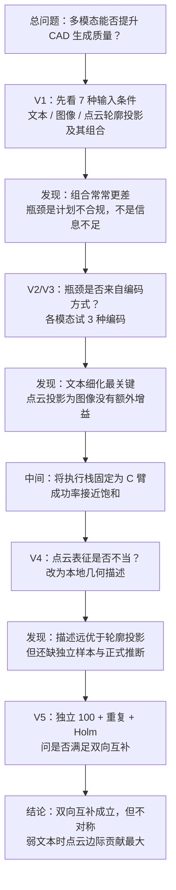

# 多模态 CAD 生成：从 V1 到 V5 的完整实验叙事

> **日期**：2026-08-24  
> **性质**：周报级综述。按实验逻辑从头讲起，不把报告写成数字册。  
> **依据**：V1–V5 中文报告，对照 `outputs/*/run_summary.json`、分析 CSV/JSON 与对应 runner 代码。  
> **读者**：组会 / 未跟过每一轮细节的人。

---

## 0. 一句话版本

我们想知道：让通用大模型根据零件信息生成可执行 CAD 时，**文本、图像、点云是互相补充，还是互相干扰**。五轮实验之后，答案不是「模态越多越好」，而是：

1. **先使执行栈稳定**，否则多模态的增益会被计划不合规与建模失败掩盖；
2. **点云不宜以轮廓投影呈现**，应在本地提取几何事实再写入提示；
3. **几何描述与图像可以双向互补，但不对称**——点云补图像的增益较大，图像补点云的增益较小；
4. **文本越弱，几何描述的边际增益越大**。这是信息缺口，不是堆叠模态。

**超出证据的表述**：通义千问直接理解了原生点云向量；交互查询已被证明有效（尚未正式 live）。

---

## 1. 问题从哪来

生成 CAD 与生成图像不同。图像「看起来像」即可；CAD 必须能逐步执行、几何有效、导出 STEP，错一步即为废件。

三类信息渠道各有缺口：

| 渠道 | 擅长 | 不擅长 |
|---|---|---|
| 文本 | 名称、步骤、尺寸说法 | 没有画面，比例靠想象 |
| 图像 | 外观、遮挡、孔槽位置 | 精确尺寸、内部结构 |
| 点云 | 三维比例、外轮廓 | 语义（哪是孔、哪是螺纹） |

理论上它们应当互补。但增加输入也可能使模型写出更复杂、更容易不合规的建模计划。因此必须在**同一样本上更换输入条件**，而不是只展示若干成功样例。

整条流水线从一开始就固定为四段。后续轮次操纵的是「输入表征」和「执行约束」，而不是更换评分口径：

```
零件信息（文本 / 图像 / 点云或其组合）
    → 大模型写出受约束的建模计划（Plan JSON，不直接写任意代码）
    → HarnessCAD 校验、修复、编译、真正建模
    → 与真值零件对齐评分，失败记 0
```

---

## 2. 五轮实验在收窄什么问题



每一轮都回答上一轮留下的**机制问题**，而不是平行堆数据集。

---

## 3. V1：模态组合是否优于单模态？（先看见瓶颈）

**逻辑**：若互补成立，同零件上「文本+图像+点云」应稳定优于最好的单模态。

**做法**：从 BenchCAD 抽取 100 个零件，7 种输入条件（T / I / P / TI / TP / IP / TIP）。点云当时是将 2048 点投影为四张深度轮廓图。模型为 `qwen3.7-plus`，尚无后来的 C 臂错误回馈。

**运行记录对得上**：`outputs/pilot_v2/run_summary.json` 记 700 任务。分析表 `pilot_v2/analysis/report_zh.md` 里每个条件 n=100。V1 报告写「445 次执行成功、439 个可评分」：本次 run_summary 是 completed 438 + skipped 7；7 条多半是更早完成被跳过，438+7=445。可评分几何 439 与分析表有效件数之和一致。差 1 条属于「completed」和「几何有效」的口径差，不影响结论。

**结论（逻辑，不是分数）**：

- 就可执行成功率而言，点云轮廓投影反而最稳定——输入简单，模型较少生成复杂计划。
- 就几何质量（成功样本）而言，详细文本最优。
- **组合模态的配对增益为负**：增加输入后整体更差。失败主要集中于 Schema / 执行，而非「模型未看见形状」。

因此 V1 支持的不是「多模态无效」，而是：**接口尚未稳定时，不宜讨论互补。**

---

## 4. V2 / V3：瓶颈是否来自编码方式不当？

**逻辑**：也许不是模态本身，而是文本过粗、图像编码不当、点云投影方式不当。于是对各模态做 3 种编码，在 20 个零件上做全因子，识别何种编码构成有效因素。

**做法**：T1 一句话概述 / T2 详细步骤 / T3 结构化清单；I1 常规渲染 / I2 法线 / I3 工程线框；P1 离散点 / P2 着色点 / P3 深度轮廓投影。20 × 63 = 1260。模型换成 `qwen3.8-max`，并加上 Plan 修复。

**运行记录对得上**：`encoding_screen_n20/run_summary.json` 写 expected_tasks=1260，本次新跑 completed 712、跳过 234（复用 V1 重叠条件）、其余为执行/解析失败。V3 报告用落盘终态 883 成功 / 1260，是把「跳过但已完成」算进去后的全矩阵口径，和「这一次进程的 counts」不同。结论应以后者为准讲逻辑，以前者为准讲「这趟 API 跑了多少」。两种口径都真实，不要混用。

**结论**：

- **主导因素是文本细化程度**，而不是更复杂的图像或点云投影。
- 图像、点云采用常规表征即可；工程图、深度图没有稳定增益。
- 较优组合接近「详细文本 + 常规渲染图」。
- 失败仍然大量来自格式不合规。因此下一轮应转向执行栈，而不是继续增加模态。

V2 是刚跑完的初稿，V3 是核对落盘后的定稿，叙事相同，V3 更可引用。

---

## 5. 中间步骤：先保证可执行性（C 臂）

编码筛选之后做了反馈小实验，再将执行栈固定为 **C 臂**：v3 提示模板 + schema 修复 R4 + 至多两轮将校验/执行报错回馈至模型再生成。

**运行记录对得上**：`confirm_n100/arms/C/run_summary.json` 为 100 零件 × 7 条件 = 700 任务，683 完成、14 执行失败、3 解析失败。成功率大约 97.6%，和后续 V4/V5 报告里「Harness 已经不是主矛盾」一致。

**逻辑后果**：此后比较「条件 A 与条件 B」，比的是**几何相似度**，不是**能否导出 STEP**。若仍将成功率提高表述为「更理解几何」，即为偷换概念。后面 V4、V5 的 McNemar 都不显著，就是在守这条口径。

---

## 6. V4：点云其实一直不是点云

**逻辑**：在 C 臂设定下重估原结果后，图像再叠加点云轮廓投影几乎没有正向互补。可能不是点云本身无信息，而是**投影表征丢失了三维几何**。外部接口又无法接受 `.npy`。于是改为本地从点云提取包围盒、主方向、对称、截面，写成结构化描述再输入模型。

三种东西必须分开：

- 原轮廓投影 `P_proj`：对照，用于检验「投影为图像」这条路径；
- 几何描述 `P_geom`：本轮处理条件；
- 神经编码 `P_enc`：未做，属后续阶段。

**运行记录对得上**：筛选 `native_pointcloud_v1/run_summary.json` 为 20×9；确认 `confirm_n100/run_summary.json` 为 100×8=800，本次 completed 606 + skipped 190（筛选/断点已完成），失败很少。V4 报告写约 795 成功 / 5 失败，与 606+190 和个位数失败同量级，差 1 来自「跳过条目是否全部可评分」。工具查询 0 次，和代码里 JSON 模式直接交计划一致，不是漏记。

**结论**：

- 几何描述显著优于原轮廓投影；图像叠加描述远优于图像叠加投影。
- 增益来自几何质量，而非成功率提升。
- 模型一次都未主动查询点云——协议要求先提交计划，因此**不能**说「交互工具有效」。
- 待补充：独立样本复核；正式显著性；以及「详细步骤 × 几何描述」对照。上述问题移交 V5。

---

## 7. V5：独立样本上预注册「互补」判定

**逻辑**：V4 可能是「这 100 个零件偶然适合该描述」。须预先写明判定：

- 点云补图像（已有图像再加描述，须显著更好）；
- 图像补点云（已有描述再加图像，须显著更好）；
- **两侧同时成立**才称为双向互补；
- 还须用原轮廓投影、错配描述排除假象；
- 弱文本增益应大于强文本——否则只是「再增加输入」。

**做法**：新 100（与 V4 原 100 无重叠）× 8 种核心输入条件 × 3 次重复 + 2 个对照各评估 1 次 = 2600。C 臂、`qwen3.8-max`、几何描述冻结为完整档 `P_full`。开跑前离线审计描述本身（不使用评分用的真值零件来构造描述）。

**运行记录对得上**：

- 预注册、新清单、shuffle 映射、证据审计都在 `outputs/v5_complementarity/`。
- 全量跑完后曾因账号欠费失败 101 条；充值后续跑，`task_failed` 清零。现状态 2580 completed / 18 episode_failed / 2 parse_failed。
- **注意**：目录里当前的 `repeats/run_summary.json` 是**最后一次续跑**写的（101 completed / 2499 skipped），不是第一趟全量那份。要以状态目录 + `analysis/v5_phase_c_live_report.json` 为准。这是真实性核对里最容易误读的一处。
- Phase B 消融、Phase D 工具协议只有 dry-run，**没有 live**。若写成「已经证明各字段的独立贡献 / 交互查询有效」，即超范围。

**结论**：

- 双向互补**成立**，但**不对称**：描述补图像是主效应，图像补描述是较小增益。
- 原轮廓投影对照、错配对照都明显更差 → 不是「再叠加一张图」或「任何几何口吻的模板化表述」。
- 弱文本下叠加描述的增益，大于详细步骤已充分时再叠加描述 → 支持信息缺口，反对「模态越多越好」。
- 独立样本上，方向与 V4 一致；图像+几何的整体水平几乎没有下降。
- 交互查询本轮确认矩阵中未启用，0 次调用是设计如此。

---

## 8. 贯穿五轮，现在可以怎样讲

### 8.1 实验逻辑上真正推进了什么

| 轮次 | 当时的研究问题 | 排除的竞争性解释 | 遗留问题 |
|---|---|---|---|
| V1 | 多模态是否有效 | 「堆叠模态即提升」 | 先解决计划合规性 |
| V2/V3 | 是否编码方式不当 | 「需要更复杂的视觉编码」 | 细化文本；执行栈仍须稳定 |
| C 臂 | 是否仍无法导出 | 「成功率低 = 模型不懂几何」 | 固定执行栈后比较几何质量 |
| V4 | 点云表征是否得当 | 「轮廓投影等同于点云」 | 改为几何描述；尚缺复核 |
| V5 | 是否真互补 | 「描述只是模板化表述 / 仅在原 100 上有效」 | 双向但不对称；工具协议另测 |

### 8.2 现在允许的表述

> 外部接口无法接受原生点云。我们用本地工具得到 point-cloud-derived structured geometric evidence。在执行栈固定、更换独立零件并做重复之后，这种方式相对轮廓投影和错配描述都提高了几何质量；与图像同时输入时表现为双向互补，且图像一侧更弱。弱文本下增益更大，符合信息缺口，而不是模态叠加。

### 8.3 现在不允许的表述

- 通义千问直接理解了点云 embedding；
- 模态越多越好；
- 本轮证明了交互式点云工具；
- 已经知道几何描述里各字段的独立贡献（Phase B 未 live）；
- 0.55 分等于论文准确率或工业可用。

---

## 9. 真实性核对（对照代码与落盘，不美化）

| 条目 | 判定 | 说明 |
|---|---|---|
| V1 700 任务、7 条件 | 通过 | `pilot_v2/run_summary.json` |
| V1「组合增益为负」 | 通过 | `pilot_v2/analysis/report_zh.md` 四个组合增益 CI 全在负侧 |
| V1 445 / 439 | 基本通过 | 445≈438+7 skipped；439=分析表有效件之和 |
| V2/V3 1260、63 条件 | 通过 | encoding 配置与 run_summary |
| V3「883 成功」vs 当次 712 | 口径不同，都真实 | 712 是当次新完成；883 含复用终态 |
| C 臂 700、接近满分 | 通过 | `confirm_n100/arms/C/run_summary.json` |
| V4 800、几何描述优于轮廓投影 | 通过 | 确认 run_summary + 条件汇总 CSV |
| V4 工具 0 次 | 通过 | 与 JSON 模式、runner 记录一致 |
| V5 新 100 无重叠、预注册 C1–C8 | 通过 | manifest / preregistration / holm CSV |
| V5 2600 补齐后无欠费失败 | 通过 | live_report：2580/18/2 |
| V5 当前 run_summary.json | **易误读** | 被续跑覆盖，须看 analysis 与 state |
| Phase B / D live | 未做 | dry-run only，不得写进主结论 |

代码侧：V4/V5 确认都走 C 臂（`feedback.py` 未改语义）；V5 的 `repeat_id`、shuffle、`P_full` 在 `pc_runner.py` / `pc_conditions.py` / `v5_shuffle.py` 中，与预注册一致。评分失败记 0 在 `pc_analysis._geometry_values`。这些不是事后改口径。

---

## 10. 下一步（仍然按问题排，不按「再跑一个矩阵」排）

1. **几何描述各字段的独立贡献**：Phase B 的 20×6 需要 live，否则只能说「整包描述有效」。
2. **交互查询**：必须换协议（Phase D 的 query_or_submit），不要和确认矩阵混写。
3. **P_enc / 换模型**：另一阶段，不能从本轮外推。

---

## 附录. 报告与产物索引

| 版本 | 文件 | 对应落盘 |
|---|---|---|
| V1 | `EXPERIMENT_REPORT_ZH.md` | `outputs/pilot_v2/` |
| V2 | `EXPERIMENT_REPORT_V2_ZH.md` | `outputs/encoding_screen_n20/`（初稿） |
| V3 | `EXPERIMENT_REPORT_V3_ZH.md` | 同上，落盘核对后 |
| C 臂确认 | 写入 V3/V4 叙述 | `outputs/confirm_n100/arms/C/` |
| V4 | `EXPERIMENT_REPORT_V4_ZH.md` | `outputs/native_pointcloud_v1/` |
| V5 | `EXPERIMENT_REPORT_V5_ZH.md` | `outputs/v5_complementarity/` |
| 本综述 | 本文件 | 以上全部 + run_summary / analysis |

*本综述少写具体分数，分数细节以各版正式报告和 analysis CSV 为准。*
