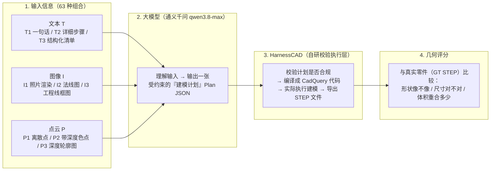
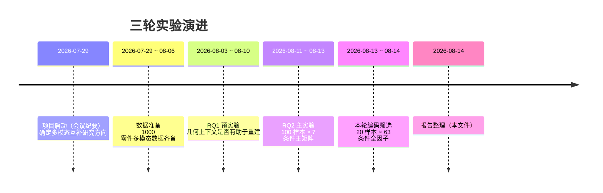
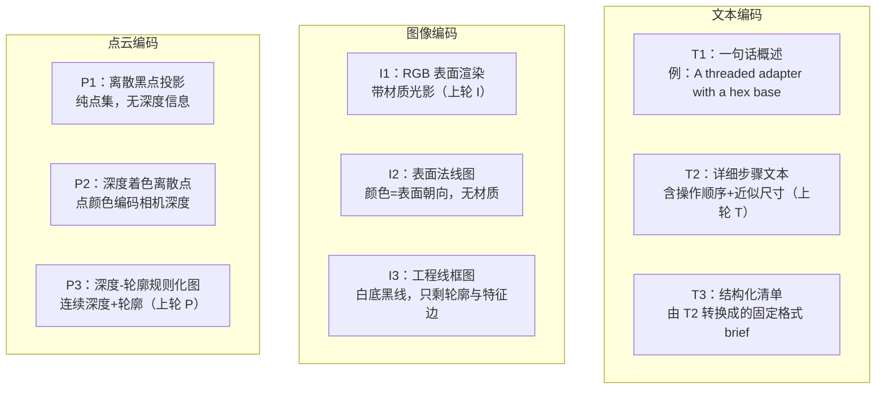
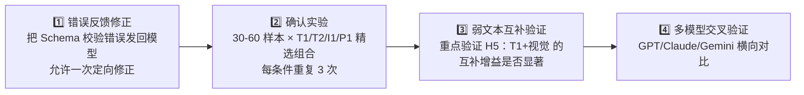

# 多模态 CAD 生成实验报告（v2 · 编码筛选实验版）

> **报告日期**：2026-08-14
> **主题**：多模态互补对 AI 生成 CAD 模型的影响 —— 第三轮实验（20 样本 × 63 编码全因子筛选）
> **覆盖范围**：项目背景 → 三轮实验回顾 → 本轮刚跑完的编码筛选实验（设计 / 指标 / 结果 / 结论）
> **读者定位**：完全不了解本项目的读者也能看懂

---

## 0. 一页读懂：我们在做什么

**一句话版本**：我们想知道，让 AI 根据描述"画"出一个机械零件的三维 CAD 模型时，**多给它看几张图片或点云，会不会画得更好**？不同模态之间是互相帮忙（互补），还是互相拖累？

**类比**：想象三个人合伙描述一个零件让画家画出来——

- **文本**（T）：一个人用嘴描述："这是个阶梯轴，左边直径 20，长 60……"。优点是尺寸和步骤说得清楚；缺点是没有画面感。
- **图像**（I）：另一个人拿零件照片给画家看。优点是外观一目了然；缺点是看不到内部结构、不知道精确尺寸。
- **点云**（P）：第三个人给画家看零件表面的几千个三维点。优点是三维比例准确；缺点是看不出哪里是孔、哪里是螺纹（没有语义）。

**实验方式**：我们让同一个大模型（通义千问）在 63 种不同的"信息组合"下，为 20 个零件生成 CAD 模型，然后用几何指标给每个结果打分，比较哪种组合最好。

---

## 1. 为什么做这个研究

### 1.1 背景

CAD（计算机辅助设计）模型是机械制造的基础：每个螺栓、齿轮、支架都要先有 CAD 模型才能生产。传统上这需要工程师手动建模；现在人们希望 AI 能自动完成。

但"AI 生成 CAD"比"AI 生成图片"难得多：

| 生成图片 | 生成 CAD |
|---|---|
| 看起来像就行 | 必须**几何上正确**：尺寸精确、步骤可执行 |
| 错了也就难看一点 | 错了会**直接执行失败**，或生成废件 |
| 没有"能不能跑"的问题 | 布尔运算可能产生空形状、非法几何 |

### 1.2 核心科学问题

不同模态携带的信息不同，理论上应该互补。但我们不知道：

1. 同一模态用**哪种表示形式**效果最好？（照片 vs 线框图；离散点 vs 深度图）
2. 互补效果是否**取决于具体编码**，而不只是"有没有这个模态"？
3. 之前点云表现好，是**点云本身**有用，还是把它转成"深度图片"后恰好撞上了视觉模型擅长的格式？

### 1.3 项目时间线

---

## 2. 之前的实验发现了什么（为什么做本轮实验）

### 2.1 第一轮：RQ1 上下文缩放预实验（8/3–8/10）

- **做法**：10 个零件 × 9 种"事实上下文"条件，模型直接输出 CadQuery 代码。
- **发现**：正确的几何事实确实有帮助（方向性信号），但模型经常写出**跑不起来的代码**（不存在的 API、语法错误）。当时判断：瓶颈是"模型直接写代码"太容易出错。

### 2.2 第二轮：RQ2 主矩阵实验（8/11–8/13）

- **做法**：针对上一轮问题，引入 **HarnessCAD**：模型不再写任意代码，而是输出受严格约束的 **Plan JSON**（相当于"填空式建模计划"），由 HarnessCAD 校验、编译、执行。100 个零件 × 7 种模态组合 = 700 次模型调用。
- **结果**：
  - 点云（P）的**生成有效率最高**（80%）；文本（T）的**质量最好**；
  - 文本+点云（TP）、三模态（TIP）在成功时几何质量最好，**但组合模态的失败率更高**，抵消了质量优势；
  - **最大瓶颈**：36% 的 Plan 因不符合格式规范（Schema 校验失败）而被拒绝——模型"想对了但没按格式写"；
  - 结论：**多模态并非没用，而是"想法"无法稳定转化为"可执行的 CAD 计划"**。

### 2.3 承上启下：两件"修复"工作（8/13）

1. **Plan v2.1 安全修复层**：针对 Schema 失败，实现确定性"格式修复"（如自动把非单位轴向量归一化、自动闭合多边形），修复后重放 700 个旧输出，看能救回多少任务。
2. **专家建议**：导师（通过微信）给出《实验清单》，建议做 **3×3×3 编码全因子筛选**：每种模态做 3 种表示形式，全面排查"哪种输入形式最好"。用户指示：样本 20 个即可，但条件一定要全面 → 20 × 63 = 1260 个任务。

---

## 3. 本轮实验：20 样本 × 63 编码全因子筛选

### 3.1 实验设计

**样本**：从上一轮 100 个零件中确定性抽取 20 个（7 个简单 / 7 个中等 / 6 个困难，覆盖不同复杂度、零件族尽量不重复），全部是 HarnessCAD 确认"可完整表达"的零件。

**条件**：三种模态各 3 种编码，每种模态也允许"不给"，排除全不给 → $(3+1)^3 - 1 = 63$ 种组合：

63 条件 = 9 个单模态 + 27 个双模态 + 27 个三模态。所有输入顺序固定（文本 → 图像 → 点云），所有视觉输入统一为 4 张 512×512 图（front/side/top/isometric）。

**与上一轮的对应关系**（用于对比）：

| 上轮条件 | 本轮等价条件 |
|---|---|
| T | T2 |
| I | I1 |
| P | P3 |
| TI | T2I1 |
| TP | T2P3 |
| IP | I1P3 |
| TIP | T2I1P3 |

### 3.2 执行概况

| 项目 | 数值 |
|---|---|
| 模型 | 通义千问 **qwen3.8-max**（上轮为 qwen3.7-plus） |
| 计划格式 | HarnessCAD Plan v2 + **修复层 v2.1（全量规则 R4）** |
| 任务总数 | 20 × 63 = **1260** |
| 实际 API 调用 | **1027 次**（234 个任务复用上轮同配置结果） |
| 总耗时 | **约 8.7 小时**（每 30 秒间隔一个请求） |
| 最终状态 | 1260 个任务全部有终态：✅ 883 执行成功 / ❌ 369 Episode 失败 / ⚠️ 8 解析失败 |
| 平均 token | 单模态 T ~1400；单模态视觉 ~2400；三模态 ~3700 |

### 3.3 用了哪些指标（大白话版）

| 指标 | 大白话解释 | 方向 |
|---|---|---|
| **解析率 / Schema 通过率** | 模型输出的 JSON 能不能被读懂、格式合不合规 | 越高越好 |
| **执行成功率 / 几何有效率** | 建模计划能不能真正跑出一个有效零件 | 越高越好 |
| **failure-aware joint quality（主指标）** | "总分"：执行失败直接记 0 分；成功则综合形状、尺寸、体积三项几何分（0~1） | 越高越好 |
| **shape-only Chamfer Distance（CD）** | 形状像不像：两个零件表面互采样最近点距离均值（已各自归一化） | 越低越好 |
| **common-frame CD** | 除形状外还惩罚尺寸和位置错误 | 越低越好 |
| **Voxel IoU** | 两个零件放进 48³ 网格，体积重合比例 | 越高越好 |

> 指标区分"失败的代价"：比如一个条件 10 次里成功 9 次但每次质量一般，另一个成功 5 次但每次近乎完美——joint quality 把两者统一到 0~1 的"总分"里比较。

---

## 4. 实验结果

### 4.1 问题一：每种模态用哪种表示形式最好？

**边际均值**（固定该编码、对其他模态取平均后的 joint quality）：

| 模态 | 第一名 | 第二名 | 第三名 | 差距 |
|---|---|---|---|---|
| 文本 | **T2 详细文本：0.386** | T3 结构化：0.310 | T1 一句话：0.181 | 第一名是第三名的 **2.1 倍** |
| 图像 | **I1 照片渲染：0.313** | I2 法线图：0.303 | I3 线框图：0.282 | 差异很小（<0.03） |
| 点云 | **P1 离散点：0.300** | P2 深度色点：0.290 | P3 深度轮廓：0.279 | 差异很小（<0.03） |

**同一样本上的直接配对比较**（win / tie / loss 表示"赢/平/输"的样本数）：

| 对比 | 均值差 | 95% CI | 赢/平/输 |
|---|---|---|---|
| T2 − T1 | **+0.213** | [0.079, 0.345] | **14/4/2** |
| T3 − T1 | +0.152 | [−0.001, 0.312] | 10/7/3 |
| T3 − T2 | −0.061 | [−0.166, 0.024] | 4/5/11 |
| I2 − I1 | −0.090 | [−0.194, 0.003] | 4/4/12 |
| I3 − I1 | −0.096 | [−0.206, 0.017] | 6/2/12 |
| P2 − P1 | −0.054 | [−0.148, 0.034] | 5/4/11 |
| P3 − P1 | +0.003 | [−0.083, 0.119] | 7/2/11 |
| P3 − P2 | +0.058 | [−0.050, 0.183] | 9/1/10 |

**读图要点**：
- **文本编码是最大的杠杆**：T1 → T2 的差距（0.21）远大于任何图像/点云编码之间的差距（≤0.09）。文本写得细不细，直接决定成败。
- **图像编码差异很小**：法线图、线框图（理论上"更几何化"的表示）并没有比普通渲染图更好——**甚至略差**。模型还是更习惯看"照片"。
- **点云编码差异也很小**：说明之前点云条件的优势**主要来自点云几何本身**，而不是"把它渲染成深度图"这个技巧。深度图（P3）并不比纯离散点（P1）好。

### 4.2 问题二：63 种组合整体排名如何？

**Top 15**：

| 排名 | 条件 | joint quality | 执行成功率 |
|---|---|---|---|
| 1 | **T2I2P1**（详细文本+法线图+离散点云） | 0.446 | 75% |
| 2 | T2I2P3 | 0.439 | 65% |
| 3 | T2I2P2 | 0.430 | 65% |
| 4 | T2I1（详细文本+照片） | 0.429 | 70% |
| 5 | T2I2 | 0.420 | 65% |
| 6 | T2I1P2 | 0.403 | 70% |
| 7 | T2I3P2 | 0.399 | 70% |
| 8 | T2I1P1 | 0.394 | 70% |
| 9 | T2I3P3 | 0.387 | 70% |
| 10 | I1P1（照片+离散点云） | 0.385 | 90% |
| 11 | T2P1 | 0.385 | 70% |
| 12 | T2I3P1 | 0.382 | 70% |
| 13 | T3I3 | 0.375 | 65% |
| 14 | T2（纯详细文本） | 0.370 | 75% |
| 15 | I1P2 | 0.358 | 85% |

**Bottom 10 全部是 T1 系列**：T1P1 (0.101)、T1P3 (0.103)、T1I2 (0.147)、T1P2 (0.150)、T1 (0.156)、T1I3P2 (0.157)……一句话文本不仅自身质量低，**加上视觉模态也救不回来**（多数组合甚至更差）。

**读图要点**：Top 15 里 13 个含 **T2**；没有 T2 的两个（I1P1、I1P2）恰好是**无文本的视觉组合**。详细文本 + 视觉是最优配方。

### 4.3 问题三：质量与成功率如何权衡？

- **右下象限（可靠但平庸）**：纯视觉条件 P1/P2/P3、I1 执行成功率 85–95%，但质量 0.21–0.31——模型看到图后倾向生成**简单、能跑**的模型，但不够精细。
- **左上象限（高质量）**：T2 系列质量 0.35–0.45，但成功率只有 65–75%——详细文本让模型生成**更复杂、更接近真实**的计划，复杂度上升带来更多执行失败。
- **最差区域**：T1 系列——既低质量又低成功率（文本太弱，模型只能瞎猜，猜出来的还常不合规）。
- **T3 系列成功率最低**（45–60%）：结构化 brief 格式反而让模型更容易违反 Schema。

### 4.4 与上一轮（100 样本主矩阵）对比

> 注意：两轮样本不同（100 vs 20）、模型不同（qwen3.7-plus vs qwen3.8-max）、修复层不同（严格 v2 vs v2.1-R4），以下对比只反映**同条件名称下的整体趋势**，是描述性的。

| 条件 | 上轮有效率 | 本轮执行成功率 | 上轮质量 | 本轮质量 |
|---|---|---|---|---|
| T2 | 58% | **75%** | 0.250 | **0.370** |
| I1 | 63% | **85%** | 0.176 | **0.312** |
| P3 | 80% | **90%** | 0.213 | 0.267 |
| T2I1 | 56% | **70%** | 0.238 | **0.429** |
| T2P3 | 55% | **65%** | 0.264 | 0.292 |
| I1P3 | 67% | **80%** | 0.201 | **0.320** |
| T2I1P3 | 60% | **65%** | 0.265 | **0.348** |

所有 7 个共享条件的**成功率全面上升**；质量在 T2 相关条件上显著提升。这提示 **qwen3.8-max + 修复层 v2.1** 缓解了上一轮"格式不合规"的瓶颈。

### 4.5 失败原因分析

- **Schema 校验失败（plan_validation_failed）仍然是第一大失败源**：369 个 Episode 失败中占大多数。即使加了 v2.1 修复层，模型仍常输出自相交多边形、非法旋转轴等难以安全修复的内容。
- 运行时异常（operation_exception）次之，集中在含文本的组合——文本诱导的复杂计划更容易在执行中途崩溃。
- 纯解析失败极少（8/1260），说明 JSON 语法已不是问题。

### 4.6 成本与质量

- 图像是主要成本：每张图约 500 token，四图条件约 2400 token，八图约 3500+，三模态约 3700。
- **纯 T2 平均仅 1485 token（最便宜），质量 0.370 却超过绝大多数"多图"组合**；
- 最贵的三模态组合（~3700 token）质量 0.35–0.45，相对 T2 的增量（+0.08）性价比不高；
- 本轮筛选出的 **Pareto 最优解 = T2I2P1**（0.446，3725 token）：加图换质量，只有在"图文并用"时才划算。

---

## 5. 结论

### 5.1 直接回答三个研究问题

**Q1：同一模态哪种表示形式最好？**

- 文本：**T2（详细步骤文本）碾压性最优**；一句话 T1 质量只有 T2 的一半不到；结构化 T3 介于两者之间但成功率最低。
- 图像：**I1（普通渲染图）略优**；法线图、线框图没有带来增益。
- 点云：**三种编码基本打平**（P1 微优）。

**Q2：多模态互补是否依赖具体编码？**

**是的**。同样"文本+点云"：
- T2P1 = 0.385（很好），T1P1 = 0.101（很差）——文本强度完全改变组合价值；
- 图像+点云组合 I1P1 = 0.385 是**唯一进 Top 10 的无文本组合**，且同时高于 I1（0.312）和 P1（0.264）单独使用；
- 因此互补**不是"加模态就变好"**，而是取决于具体编码搭配。

**Q3：点云的优势来自点云本身还是"深度图化"？**

**来自点云本身**。P3（深度-轮廓规则化图）与 P1（纯离散点）在质量和成功率上无显著差异（P1 甚至微优）。上一轮"点云最稳定"的结论不依赖深度图渲染技巧，离散点集对模型同样友好。

### 5.2 预注册假设验证（《实验清单》第十节）

| 假设 | 判定 | 依据 |
|---|---|---|
| H1：T3 比 T2 有更高 Schema 通过率 | ❌ 不成立 | T3 系列成功率反而最低（45–60%） |
| H2：I2/I3 比 I1 更强调几何结构 | ❌ 未体现 | I2/I3 质量反而略低于 I1 |
| H3：P2 比 P1 更易恢复三维比例 | ❌ 不成立 | P1 ≥ P2（配对 5 胜 11 负） |
| H4：P3 具有最高可执行性 | ❌ 不成立 | P2 成功率 95% 最高，P3 与 P1 打平 |
| H5：弱文本（T1）与视觉的互补收益更大 | 🟡 **部分成立** | T1I1P1 (0.270) 比 T1 (0.156) 提升 73%；但 T1P 系列反而下降 |
| H6：最优组合≠各模态独立最优的拼装 | ✅ **成立** | 全局最优 T2I2P1：I2 不是最优图像编码（I1 才是） |

### 5.3 核心结论

1. **文本详细程度是当前最大的杠杆**：T1→T2 提升 0.21，远超任何视觉编码变化。信息丰富的文本是强基线。
2. **视觉模态是"锦上添花"而非"雪中送炭"**：在强文本（T2）基础上加图可小幅提升质量（0.370→0.446），但代价是成功率下降和 2.5 倍 token 成本。
3. **弱文本下多模态有一定补偿潜力**：T1 质量仅为 T2 的 47%，但 T1I1P1 把 T1 提了 73%——这提示"信息缺口越大，互补空间越大"，值得在更大样本上验证。
4. **"想得对但写不对"仍是核心瓶颈**：Schema 失败占比仍高，模型生成合法几何的意图常因格式细节被拒——下一阶段应把校验错误反馈给模型做一次定向修正。
5. **简单视觉输入（照片、离散点）就够了**：法线图、线框图、深度图等"工程化表示"没有带来收益——不需要过度预处理，模型习惯自然图像。

---

## 6. 局限与注意事项

- 本轮是**筛选实验**（每条件仅 20 样本、单次推理），只做描述性排名，未做显著性检验，不宣称统计结论；
- 两轮实验模型与样本不同，4.4 的对比只能看趋势；
- T2 文本是接近"操作配方"的程序化文本，属于特权信息，真实用户的自然语言描述通常达不到这种强度；
- 点云以"图像投影"方式输入（API 不支持原生三维数据），结论不能外推到原生点云模型；
- 只测了通义千问一个模型家族；
- 文献对齐指标（F1@0.01、shape-only IoU 等）的离线回填正在进行中，完成后可作为附录补充。

---

## 7. 下一步建议

1. **第一优先**：把 369 个失败任务的具体校验错误反馈给模型，允许一次修正，量化"反馈闭环"能救回多少任务；
2. **第二优先**：用本轮筛出的最优编码（T2、I1、P1 及 T2I1P1）设计确认实验，30–60 样本、每条件 3 次重复，做正式统计检验；
3. **第三优先**：专门验证 H5——弱文本场景下多模态互补是否显著（这直接关系到"普通用户一句话描述"的实际价值）；
4. 长期：冲突/缺失/退化场景（文本与图像互相矛盾、图像模糊、点云缺失），以及原生点云模型对比。

---

## 附录 A. 数据与复现文件

| 内容 | 路径 |
|---|---|
| 本轮实验配置 | `experiments/rq2_multimodal_harness/configs/encoding_screen_n20.yaml` |
| 运行与验证 | `outputs/encoding_screen_n20/run_summary.json`、`verification.json` |
| 条件汇总 | `outputs/encoding_screen_n20/analysis/encoding_condition_summary.csv` |
| 逐任务明细 | `outputs/encoding_screen_n20/analysis/encoding_task_rows.csv` |
| 失败汇总 | `outputs/encoding_screen_n20/analysis/encoding_failure_summary.csv` |
| 交互效应 | `outputs/encoding_screen_n20/analysis/encoding_interactions.csv` |
| 成本汇总 | `outputs/encoding_screen_n20/analysis/encoding_cost_summary.csv` |
| Pareto 分析 | `outputs/encoding_screen_n20/analysis/encoding_pareto.csv` |
| 本轮分析报告（自动生成） | `outputs/encoding_screen_n20/analysis/ENCODING_SCREEN_REPORT_ZH.md` |
| 上轮主实验报告 | `experiments/rq2_multimodal_harness/EXPERIMENT_REPORT_ZH.md` |
| 实验清单（导师方案） | 微信文件《实验清单.txt》（2026-08-13） |
| 本报告图表 | `outputs/encoding_screen_n20/analysis/figures/report_v2/*.png` |

## 附录 B. 术语速查

| 术语 | 含义 |
|---|---|
| CAD | Computer-Aided Design，计算机辅助设计（三维建模） |
| STEP | 工业标准 CAD 交换格式文件 |
| CadQuery | 用 Python 代码参数化建模的库 |
| Plan | 本项目中模型输出的"结构化建模计划"（JSON），代替任意代码 |
| HarnessCAD | 自研的 Plan 校验+编译+执行层 |
| GT（Ground Truth） | 数据集中的真实零件，用于打分 |
| Schema | Plan 必须遵守的格式规范 |
| joint quality | 综合质量分（失败记 0），主指标 |
| Pareto 最优 | 没有其他条件能在"质量"和"成本"上同时胜过它 |

---

*报告生成：2026-08-14。数据来源：`experiments/rq2_multimodal_harness/outputs/encoding_screen_n20` 分析产物与 `pilot_v2` 历史分析。*
