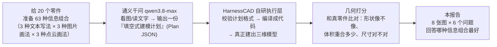
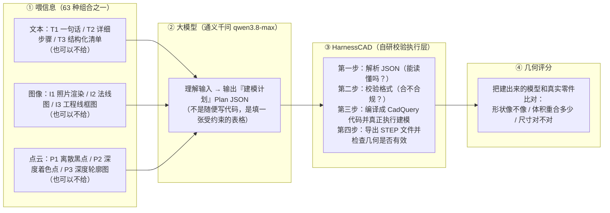
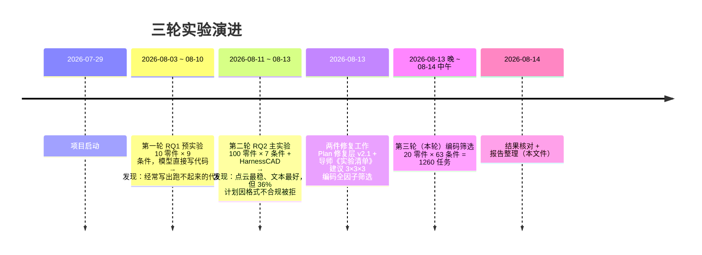
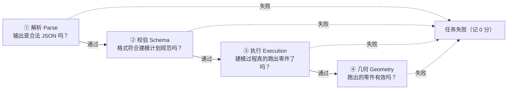
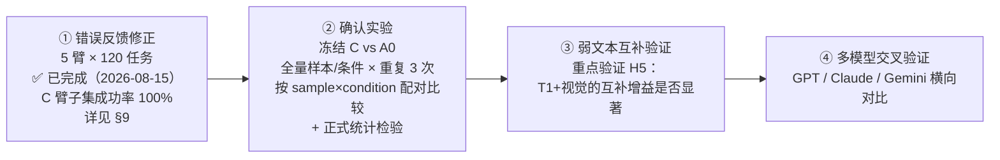

# 多模态 CAD 生成实验报告（v3 · 最终版）

> **报告日期**：2026-08-14
> **主题**：给 AI 看"不同形式的文本 / 图片 / 点云"，哪种组合能让它更好地画出三维机械零件？—— 20 个零件 × 63 种信息组合的全因子筛选实验（刚跑完）
> **本版与上一版（v2）的区别**：v2 是在实验刚结束时赶写的初稿；本版在核对最终落盘数据（1260 个任务全部有终态、验证通过）后重写，并补齐了 **8 张真实数据图表**、执行概况复核、失败原因精确统计和"实验计划 vs 实际执行"逐条对照。
> **读者定位**：完全不了解本项目的读者也能看懂；所有专业词都配了白话解释。

---

## 0. 30 秒读懂这份报告

**一句话**：我们想知道，让 AI 根据描述"画"出一个机械零件的三维 CAD 模型时，**喂给它的信息（文本、图片、点云）用哪种"写法"最好**？结论是——**文本写得细不细最关键（差距高达 2.1 倍）；图片、点云用普通形式即可，花哨的工程图/深度图没有额外好处；"详细文本 + 普通图片"是最划算的配方。**

| 关键数字 | 含义 |
|---|---|
| **1260** | 实验总任务数 = 20 个零件 × 63 种信息组合 |
| **70.1%** | 总体执行成功率（883 / 1260 次真正建出了零件） |
| **0.446** | 全场最高总分：`T2I2P1`（详细文本 + 法线图 + 离散点云） |
| **2.1 倍** | 文本编码 T2（详细步骤）的总分是 T1（一句话）的 2.1 倍 —— 全场最大的单一杠杆 |
| **57%** | 失败任务中"格式不合规被拒"的占比 —— 当前最大瓶颈 |



---

## 1. 我们在研究什么问题（背景）

### 1.1 为什么"AI 画零件"比"AI 画图片"难

CAD（计算机辅助设计）模型是机械制造的基础：每个螺栓、齿轮、支架都要先有 CAD 模型才能生产。传统上这需要工程师手动建模；现在人们希望 AI 自动完成。但"AI 生成 CAD"比"AI 生成图片"难得多：

| | 生成图片 | 生成 CAD |
|---|---|---|
| 要求 | 看起来像就行 | 必须**几何上正确**：尺寸精确、每一步都可执行 |
| 错了的后果 | 难看一点 | 直接**执行失败**，或生成废件 |
| 有没有"跑不跑得通"的问题 | 没有 | 布尔运算可能产生空形状、非法几何 |

### 1.2 三种"信息渠道"各有优缺点

同一个零件，可以告诉 AI 三种信息（我们称为三种**模态**）：

- **文本（T）**："这是个阶梯轴，左边直径 20、长 60……"。优点是尺寸和步骤说得清楚；缺点是没有画面感。
- **图像（I）**：给 AI 看零件照片。优点是外观一目了然；缺点是看不到内部结构、不知道精确尺寸。
- **点云（P）**：零件表面的几千个三维点的投影。优点是三维比例准确；缺点是看不出哪里是孔、哪里是螺纹（没有语义）。

**理论上它们应该互补**（比如：文本说尺寸、图片给外观、点云给比例）。但上一轮实验发现：把几个模态混在一起，**失败率反而升高**——不是信息没用，而是"信息变多后，AI 更常写出格式不合规的计划"。所以本轮实验专门排查：**每种模态用哪种"表示形式"（写法）最好？互补效果是否取决于具体写法？**

### 1.3 完整流水线（每跑一个任务都经过这四步）



> 关键设计：模型**不直接写代码**（上一轮证明那样太容易出错），而是输出一份受严格约束的"填空式建模计划"（Plan JSON）。任何一步失败，这个任务就记为失败。

### 1.4 项目时间线



---

## 2. 这个实验是怎么设计的（含"实验计划 vs 实际执行"对照）

### 2.1 导师《实验清单》说了什么

8 月 13 日导师通过微信给出《实验清单》，核心要求是：**每种模态做 3 种"表示形式"，把所有组合都测一遍**（全因子筛选），排查"哪种输入写法最好"，并提出了 6 条可提前验证的假设（见 §5）。用户指示：**样本 20 个即可，但条件一定要全面**。

### 2.2 计划 vs 实际执行（逐条对照）

| # | 清单要求 | 实际执行 | 状态 |
|---|---|---|---|
| 1 | 文本做 3 种编码 | T1 一句话概述 / T2 详细步骤（含近似尺寸）/ T3 由 T2 转换成的结构化清单 | ✅ |
| 2 | 图像做 3 种编码 | I1 RGB 照片渲染 / I2 表面法线图 / I3 工程线框图（白底黑线） | ✅ |
| 3 | 点云做 3 种编码 | P1 纯离散黑点（无深度）/ P2 深度着色点 / P3 深度+轮廓规则化图 | ✅ |
| 4 | 每种模态允许"不给"，排除全不给 | (3+1)³ − 1 = **63 种组合**：9 单模态 + 27 双模态 + 27 三模态 | ✅ |
| 5 | 样本 12 个（原建议） | 用户改为 **20 个**（7 简单 / 7 中等 / 6 困难，20 个不同零件族，全部经 HarnessCAD 确认可完整表达） | ✅ 用户改 |
| 6 | 全部组合 × 全部样本 | 20 × 63 = **1260 个任务**，全部有终态，验证通过 | ✅ |
| 7 | 预注册 6 条假设 H1–H6 | 已逐条验证，见 §5 | ✅ |
| 8 | 预注册比较族（不做 1953 对全比较） | 只做预注册的配对比较：9 组单模态 + 固定其他模态的替换比较 + 双模态增益 + 三模态增量 | ✅ |
| 9 | failure-aware 指标（失败要计入惩罚） | 主指标 joint quality：任何一步失败直接记 0 分 | ✅ |
| 10 | 记录每个条件的成本 | 逐任务记录 token 数、延迟，汇总见 §4.6 | ✅ |
| 11 | 质量—成本 Pareto 分析 | 已产出，见 §4.6 | ✅ |
| 12 | 输出 CSV/JSON/中文报告 + 带单位的图 | 全部落盘（路径见附录 A） | ✅ |

### 2.3 63 种组合长什么样

```
        T（文本）          I（图像）             P（点云）
      ┌────────────┐   ┌──────────────┐   ┌────────────────┐
      │ 无（不给）   │   │ 无（不给）     │   │ 无（不给）       │
      │ T1 一句话   │   │ I1 照片渲染    │   │ P1 离散黑点      │
      │ T2 详细步骤 │   │ I2 表面法线图  │   │ P2 深度着色点    │
      │ T3 结构化清单│   │ I3 工程线框图  │   │ P3 深度轮廓图    │
      └────────────┘   └──────────────┘   └────────────────┘
      任选其一（含"不给"），三者全不选的情况排除 → 4×4×4−1 = 63 种组合
      组合命名如 T2I2P1 = 详细文本 + 法线图 + 离散点云
```

- 与上一轮（100 样本 × 7 条件）的对应关系：上一轮的 `T/I/P/TI/TP/IP/TIP` = 本轮的 `T2/I1/P3/T2I1/T2P3/I1P3/T2I1P3`（详见 §4.4 对比）。
- 所有视觉输入统一为 4 张 512×512 图（前 / 侧 / 顶 / 等轴测）；所有输入顺序固定（文本 → 图像 → 点云）。
- 主文本只使用高清渲染图核对过的英文三级描述 `hdv3 en/L3`。

### 2.4 执行概况（最终落盘数据）

| 项目 | 数值 | 说明 |
|---|---|---|
| 模型 | 通义千问 **qwen3.8-max** | 上一轮是 qwen3.7-plus |
| 计划格式 | HarnessCAD Plan v2 + 修复层 **v2.1-R4** | 修复层用于救回"格式差一点"的输出 |
| 任务总数 | **1260**（20 × 63） | 全部有终态，`verification.json` 校验通过 |
| 实际 API 调用 | **1027 次** | 234 个任务复用上一轮同配置结果（不重复花钱） |
| 总耗时 | **约 8.7 小时** | 请求间隔 30 秒（限流） |
| 最终去向 | ✅ 883 成功（其中 2 个几何无效） / ❌ 369 执行失败 / ⚠️ 8 解析失败 | 成功率 70.1% |
| token 总量 | **395 万** | 纯文本 ~1.5 千/次；三模态 ~3.7 千/次 |
| 平均延迟 | 12.5 秒 / 请求 | |

---

## 3. 我们用什么标准打分（指标，大白话版）

每个任务都要闯四关，闯关结果就是指标：



| 指标 | 大白话解释 | 方向 |
|---|---|---|
| **解析率 / Schema 通过率** | 模型输出的计划能不能被读懂、格式合不合规 | 越高越好 |
| **执行成功率** | 计划能不能真正跑出一个有效零件（本报告用它指"几何有效"） | 越高越好 |
| **joint quality（主指标，总分）** | 成功任务的综合质量分（0~1）：把形状像不像（Chamfer 距离）、体积重合多少（体素 IoU）综合起来；**任何一步失败直接记 0 分** | 越高越好 |
| **shape-only Chamfer Distance（CD）** | 形状像不像：两个零件表面互相采样最近点，距离均值（先各自归一化，只比形状不比大小） | 越低越好 |
| **common-frame CD** | 除形状外还惩罚尺寸、位置错误（预测保留原始尺度） | 越低越好 |
| **Voxel IoU** | 把两个零件放进 48×48×48 的立体网格，体积重合比例 | 越高越好 |
| **token 数 / 延迟** | 成本：每次请求花多少 token、多少秒 | 越低越好 |

> **为什么"总分"要失败记 0？** 举例：A 条件 10 次里成功 9 次但每次质量一般，B 条件只成功 5 次但每次近乎完美。如果只看"成功时的质量"，B 会虚高。把失败记 0 之后，两者才能放进同一个 0~1 的"总分"里公平比较——这个口径与 text-to-CAD 文献的 Invalid Ratio 思想一致。

---

## 4. 实验结果（6 个问题，每个问题一张图）

### 4.1 问题一：同一种模态，用哪种"写法"最好？

**做法**：固定某一种写法，把其余两种模态的所有组合取平均（"边际均值"），看谁的贡献最大。


| 模态 | 第一名 | 第二名 | 第三名 | 解读 |
|---|---|---|---|---|
| 文本 | **T2 详细文本：0.386** | T3 结构化：0.310 | T1 一句话：0.181 | **第一名是第三名的 2.1 倍**——文本写法是全场最大杠杆 |
| 图像 | **I1 照片渲染：0.313** | I2 法线图：0.302 | I3 线框图：0.282 | 差距很小（<0.03），"更几何化"的图并没有更好 |
| 点云 | **P1 离散黑点：0.300** | P2 深度色点：0.290 | P3 深度轮廓：0.279 | 差距很小（<0.03），三种写法基本打平 |

**同一批零件上的两两对决**（9 组预注册配对比较，带 95% 置信区间；区间不含 0 才算"方向可信"）：


| 对比 | 均值差 | 95% CI | 赢/平/输 | 结论 |
|---|---|---|---|---|
| **T2 − T1** | **+0.213** | [0.079, 0.345] | 14/4/2 | ✅ 唯一一组置信区间不含 0：**T2 显著更好** |
| T3 − T1 | +0.152 | [−0.001, 0.312] | 10/7/3 | 方向为正但未分开 |
| T3 − T2 | −0.061 | [−0.166, 0.024] | 4/5/11 | 无差异 |
| I2 − I1 | −0.090 | [−0.194, 0.003] | 4/4/12 | 略差，未显著 |
| I3 − I1 | −0.096 | [−0.206, 0.017] | 6/2/12 | 略差，未显著 |
| I3 − I2 | −0.006 | [−0.115, 0.101] | 8/3/9 | 打平 |
| P2 − P1 | −0.054 | [−0.148, 0.034] | 5/4/11 | 略差，未显著 |
| P3 − P1 | +0.003 | [−0.083, 0.119] | 7/2/11 | 打平 |
| P3 − P2 | +0.058 | [−0.050, 0.183] | 9/1/10 | 打平 |

**读图要点**：
- **文本写法决定成败**：T1→T2 的差距（0.21）远大于任何图像/点云写法的差距（≤0.09）。把文本从"一句话"换成"详细步骤"，效果立竿见影。
- **图像：普通照片就够**。理论上"更几何化"的法线图、线框图**并没有更好，反而略差**——模型更习惯看"照片"。
- **点云：写法无所谓**。深度图（P3）并不比纯离散点（P1）好——上一轮"点云最稳"的结论**来自点云几何本身，而不是'把它画成深度图'这个技巧**。

### 4.2 问题二：63 种组合的整体排名


**Top 10（前 9 名全部含 T2 详细文本）：**

| 排名 | 条件 | 是什么 | 总分 | 成功率 |
|---|---|---|---|---|
| 1 | **T2I2P1** | 详细文本 + 法线图 + 离散点云 | **0.446** | 75% |
| 2 | T2I2P3 | 详细文本 + 法线图 + 深度轮廓 | 0.439 | 65% |
| 3 | T2I2P2 | 详细文本 + 法线图 + 深度点 | 0.430 | 65% |
| 4 | T2I1 | 详细文本 + 照片 | 0.429 | 70% |
| 5 | T2I2 | 详细文本 + 法线图 | 0.420 | 65% |
| 6 | T2I1P2 | 详细文本 + 照片 + 深度点 | 0.403 | 70% |
| 7 | T2I3P2 | 详细文本 + 线框图 + 深度点 | 0.399 | 70% |
| 8 | T2I1P1 | 详细文本 + 照片 + 离散点云 | 0.394 | 70% |
| 9 | T2I3P3 | 详细文本 + 线框图 + 深度轮廓 | 0.387 | 70% |
| 10 | **I1P1** | 照片 + 离散点云（**无文本**） | 0.385 | **90%** |

**Bottom 10 全部含 T1（一句话文本）**：T1P1（0.101）、T1P3（0.103）、T1I2（0.147）……一句话文本不仅自身质量低，**加上视觉模态也救不回来**。

**用热力图看整体结构**（行 = 文本强弱，列 = 图像 × 点云组合）：


- **T2 那一行整体最绿**（0.35–0.45）；**T1 那一行整体偏红**（0.10–0.27）——文本强弱几乎决定了一切；
- 无文本的视觉组合里，**I1P1（照片+离散点云）是最亮的格子**（0.385），且成功率 90%——"看两张普通图"是纯视觉路线的最优解；
- 有意思的是：**I1P1 比纯 I1（0.312）和纯 P1（0.264）都好**，这是真正的"图像 + 点云互补"，不需要任何文本。

### 4.3 问题三：质量与成功率如何权衡？


- **右下象限（跑得通但平庸）**：纯视觉条件 P1/P2/P3、I1 成功率 85–95%，但总分只有 0.21–0.31——看到图后模型倾向生成**简单、能跑**的模型，但不够精细。
- **左上象限（质量高但常跑不通）**：T2 系列质量 0.35–0.45，但成功率只有 65–75%——详细文本让模型生成**更复杂、更接近真实**的计划，复杂度上升带来更多执行失败。
- **左下象限（最差区域）**：T1 系列既低质量又低成功率——文本太弱，模型只能瞎猜，猜出来的还常不合规。
- **T3 系列成功率最低（45–65%，T3I1 低至 45%）**：结构化清单格式反而让模型更容易违反 Schema（这直接推翻了假设 H1，见 §5）。

> 简单 vs 中/困难零件的整体差异（附录数据）：简单零件成功率 **92%**、总分 0.40；中/困难零件只有 54–63%、0.22–0.23——**"难的零件 + 复杂的输入"最容易翻车**。

### 4.4 问题四：和上一轮（100 样本 × 7 条件）相比，进步了吗？


> 注意：两轮样本不同（100 vs 20）、模型不同（qwen3.7-plus vs qwen3.8-max）、修复层不同，所以下表**只能看趋势，是描述性的**。

| 条件 | 上轮成功率 | 本轮成功率 | 上轮质量 | 本轮质量 |
|---|---|---|---|---|
| T（T2） | 58% | **75%** | 0.250 | **0.370** |
| I（I1） | 63% | **85%** | 0.176 | **0.312** |
| P（P3） | 80% | **90%** | 0.213 | **0.267** |
| T+I（T2I1） | 56% | **70%** | 0.238 | **0.429** |
| T+P（T2P3） | 55% | **65%** | 0.264 | 0.292 |
| I+P（I1P3） | 67% | **80%** | 0.201 | **0.320** |
| T+I+P（T2I1P3） | 60% | **65%** | 0.265 | **0.348** |

**7 个共享条件的成功率全面上升**；质量在含 T2 的条件上显著提升。这说明 **qwen3.8-max + 修复层 v2.1** 确实缓解了上一轮"36% 计划因格式不合规被拒"的瓶颈（本轮总体失败里格式问题占 57%，但总体成功率已从约 60% 升到 70%）。

### 4.5 问题五：失败的 377 次任务都死在哪一步？


| 最终去向 | 次数 | 占比 | 说明 |
|---|---|---|---|
| ✅ 完全成功（几何有效） | **881** | 69.9% | |
| ❌ Schema 校验失败 | **214** | 17.0% | 占失败任务的 **57%**：模型"想对了但没按格式写"（自相交多边形、非法旋转轴等，修复层也救不回来） |
| ❌ 运行时异常 | **155** | 12.3% | 占失败任务的 41%：计划合法但执行到某一步崩溃 |
| ⚠️ 解析失败 | 8 | 0.6% | JSON 语法错误，几乎绝迹 |
| ⚠️ 几何无效（STEP 形状） | 2 | 0.2% | 建出来了但形状无效 |

**按文本强弱分组看（图右）**：
- **无文本 / T2 / T3 组**：失败大头是 **Schema 校验**（格式不合规）；
- **T1 组**：失败大头变成了 **运行时异常**——一句话文本让模型"硬猜"复杂几何，计划经常在执行中途崩溃（如空形状、非法布尔运算）。

**一句话总结**："格式不合规"仍是第一大失败源（占失败 57%），但已经从上一轮的"36% 全体任务被拒"改善到本轮"17% 全体任务被拒"。

### 4.6 问题六：多花的钱（token）换来了质量吗？


| 条件 | 平均 token/次 | 总分 | 性价比点评 |
|---|---|---|---|
| **T2（纯详细文本）** | **1,485** | 0.370 | **全场最便宜，质量却超过绝大多数"多图"组合** |
| T2I1（文本+照片） | 2,666 | 0.429 | +80% 成本换 +16% 质量，划算 |
| T2I2P1（三模态，全场最优） | 3,725 | 0.446 | 2.5 倍成本换 +20% 质量，看预算 |
| I1（纯照片） | 2,422 | 0.312 | 比纯文本贵 63%，质量反而更低 |
| T1I3P3（弱文本三模态） | 3,739 | 0.179 | **又贵又差**：文本弱，加多少图都没用 |

- 每张图 ≈ 500+ token：4 图条件 ~2.4 千、8 图 ~3.5 千、三模态 ~3.7 千 token；
- **Pareto 最优解 = T2I2P1**（0.446，3,725 token）：没有其他组合能在"质量"和"成本"上同时超过它；
- 实用建议：**预算有限就用纯 T2**；想冲质量就 T2I1 或 T2I2P1；**没有好文本时别堆图**（T1 系列又贵又差）。

### 4.7 专项：多模态真的"互补"吗？（严格口径逐样本验证）

前面 §4.2 看到"最好成绩"几乎都是多模态组合。但"组合的平均分最高"和"同一零件上加一个模态会变得更好"是两回事。这里用与上一轮相同的**严格互补口径**验证：对每个零件，`增益 = 组合的分数 − 该零件上最佳单模态的分数`（逐样本配对，失败记 0）。


**总体结论：严格口径下"多模态一定更好"不成立，但存在两类明确的局部互补。**

| 口径 | 结果 |
|---|---|
| 27 个双模态 vs 其最佳单模态 | 平均增益 **−0.109**；只有 **2/27 为正**（I2P2 +0.022、I1P1 +0.018），且都不显著；平均只有 24.8% 的零件"组合严格更好" |
| 27 个三模态 vs 其最佳双模态 | 平均增益 **−0.160**；**0/27 为正** |
| 按组合类型分（双模态平均增益） | **图像+点云 IP：−0.044**（最好）｜文本+图像 TI：−0.121｜文本+点云 TP：−0.161（最差） |
| 按文本强弱分 | 无文本视觉组合 −0.044｜T2 −0.120｜T3 −0.139｜T1 −0.163 |

**为什么总体是负的？** 因为强文本 T2 单用已经接近天花板，加图加云只会给部分零件引入执行失败；而弱文本 T1 加视觉经常反而被干扰。但这**不等于没有互补**——把镜头对准"显著正向的配对"（95% 置信区间整体在 0 以上），证据高度集中在两个方向上：

| 显著正向的配对（组合 − 弱组件） | 增益 | 95% CI | 赢/平/输 | 说明 |
|---|---|---|---|---|
| I1P1 − P1 | **+0.121** | [0.027, 0.234] | 15/1/4 | 给点云加一张照片，显著变好 |
| I1P2 − P2 | **+0.149** | [0.018, 0.284] | 13/1/6 | 同上 |
| I2P2 − I2 | **+0.078** | [0.017, 0.152] | 11/5/4 | 给法线图加点云，显著变好 |
| T2I2 − I2 | **+0.199** | [0.023, 0.377] | 10/4/6 | 给法线图加详细文本，显著变好 |
| T1I1P1 − T1I1 | **+0.102** | [0.021, 0.199] | 10/5/5 | 弱文本下再加点云，显著变好 |
| T1I1P1 − T1P1 | **+0.170** | [0.064, 0.291] | 13/3/4 | 弱文本下加图像，显著变好 |

**读图要点**：
1. **"图像 + 点云"是互补性最强的通道**：IP 类平均增益最接近 0，I1P1 在条件均值上同时超过 I1（0.312）和 P1（0.264），且成功率保持 90% 不降——这是全场最干净的互补案例。
2. **互补集中在"给弱模态补强"**：所有显著增益都是"弱组件（纯视觉 / 弱文本）+ 强信息"的方向；反过来，给已经很全的 T2 硬加模态（TP、三模态）是显著**负**增益（T2P3 −0.216、T3I1 −0.214、T1P1 −0.213，CI 全在 0 以下）。
3. **天花板仍靠多模态**：T2I1（0.429）与 T2I2P1（0.446）是全场最高分，比纯 T2（0.370）高 16–21%——多模态的价值是"把上限抬高"，代价是个别样本翻车（这就是均值口径为负、最高分口径为正的原因）。
4. **与上一轮对比**：上轮 4 个共享组合的增益全部显著为负（TI −0.081 / TP −0.085 / IP −0.073 / TIP −0.115）；本轮 T2I1 −0.078、I1P3 −0.063（持平或略好），T2P3 −0.216、T2I1P3 −0.230（更差）。**互补性没有被"修好"，但图像+点云通道首次出现了正增益组合。**

### 4.8 目前生成水平定位：离"能用"还有多远


| 维度 | 数值 | 解读 |
|---|---|---|
| 总体成功率 | **70.1%**（883/1260） | 三成任务仍失败（其中 57% 是格式不合规） |
| 全员平均分 | **0.288** | 失败记 0 拉低整体 |
| 成功任务平均分 | **0.411**（中位 0.319，上四分位 0.678） | 成功也不代表高分：一半成功任务得分 <0.32 |
| 最佳单模态 | T2：0.370，成功率 75% | 当前"性价比之王" |
| 最佳双模态 | T2I1：0.429，成功率 70% | 天花板 +16% |
| 最佳三模态 | T2I2P1：0.446，成功率 75% | 全场最高，成本 2.5 倍 |
| 几何口径（最佳条件） | 形状 CD ≈ 0.07（归一化后），体素 IoU ≈ 0.61 | **形状大体对、体积重合过半，但细节特征常缺失或出错** |
| 按难度 | 简单：92% 成功 / 0.40 分｜中等：54% / 0.23｜困难：63% / 0.22 | 简单零件已相当稳；中/困难零件质量明显不足 |

**怎么理解这个水平**（满分 1.0 = 与真实零件在形状和体积上完全重合）：
- **已经能做到**：拿到详细文本（甚至只给照片+点云），把 20 个零件里的大部分"能跑通、形状轮廓大致正确"地建出来，简单零件成功率超九成；
- **还做不到**：中/困难零件的精细特征（孔位、倒角、齿形、键槽等）经常错位或丢失；约三成任务执行失败；最好条件的总分也只有 0.45 左右——**距"工业可用"（接近满分 + 几乎不失败）仍有明显距离**；
- **相对进步**：相比上一轮（成功率约 60%、纯文本质量 0.25），本轮成功率提升到 70%、纯文本质量 0.37——"格式不合规"瓶颈正在缓解，但仍是第一大失败源。

---

## 5. 预注册假设验证（对照实验计划的 H1–H6）

实验开始前就在《实验清单》里写好了 6 条假设，现在逐条对照数据回答（这不是"事后找解释"，而是"事前押注"）：

| 假设 | 判定 | 依据 |
|---|---|---|
| **H1**：结构化文本 T3 比 T2 有更高 Schema 通过率 | ❌ **不成立** | T3 系列执行成功率反而全场最低（45–65%）：结构化格式诱导出更多不合规字段 |
| **H2**：法线图 I2 / 线框图 I3 比照片 I1 更能强调几何结构 | ❌ **未体现** | I2 / I3 总分反而略低于 I1（配对 4 胜 12 负、6 胜 12 负） |
| **H3**：深度着色点 P2 比纯离散点 P1 更易恢复三维比例 | ❌ **不成立** | P1 ≥ P2（配对 5 胜 11 负） |
| **H4**：深度轮廓图 P3 具有最高可执行性 | ❌ **不成立** | P2 成功率 95% 才是最高；P3 与 P1 打平 |
| **H5**：弱文本（T1）与视觉模态的互补收益更大 | 🟡 **部分成立** | 支持：T1I1P1（0.270）比纯 T1（0.156）提升 73%；不支持：T1P 系列反而比纯 T1 更差 |
| **H6**：最优组合 ≠ 各模态独立最优写法的简单拼装 | ✅ **成立** | 全局最优 T2I2P1 用的是 **I2 法线图**（不是独立最优的 I1 照片）——组合效应确实存在 |

**6 条假设只有 1 条完全成立、1 条部分成立，4 条被推翻**——这恰恰说明"先筛选、再下结论"的必要性：很多直觉上"应该更好"的工程化表示（法线图、深度图、结构化清单）实际并没有带来收益。

---

## 6. 核心结论（大白话）

1. **文本写得细不细是当前最大的杠杆**。T1→T2 提升 0.21，是唯一一组置信区间不含 0 的配对比较；而图像、点云的 6 组内部对比全都没有显著差异。**"好好写说明书"比"多拍几张照片"重要得多。**
2. **视觉模态是"锦上添花"而非"雪中送炭"**。在强文本 T2 基础上加图，质量从 0.370 提升到 0.446（+20%），但成功率会下降 5–10 个百分点，成本翻 2.5 倍。
3. **纯视觉路线也有自己的最优解**：I1P1（照片 + 离散点云）无文本即可达到 0.385 / 90% 成功率，超过纯图像和纯点云——图像与点云之间存在真实的互补。
4. **"想得对但写不对"仍是核心瓶颈**：57% 的失败来自格式不合规。"把校验/执行错误反馈给模型、允许定向修正"的闭环已在本轮 RQ2b 实验中验证：6 条件子集上 C 臂（v3 prompt + 2 轮反馈）成功率 100%（详见 §9）。
5. **简单输入就够了**：法线图、线框图、深度图、结构化清单这些"工程化预处理"全部没有带来收益——模型习惯自然照片和朴素文本，**不要过度加工数据**。
6. **弱文本下多模态有一定补偿潜力**（H5 部分成立）：信息缺口越大，互补空间越大——这直接关系到"普通用户一句话描述"场景的实际价值，值得用更大样本验证。

---

## 7. 局限与注意事项

- 本轮是**筛选实验**（每条件仅 20 个样本、单次推理），只做描述性排名；除 T2−T1 外都不宣称统计显著性；
- 与上一轮的对比（§4.4）**两轮模型与样本都不同**，只能看趋势；
- T2 文本接近"操作配方"的程序化描述，属于**特权信息**——真实用户的自然语言通常达不到这种强度；
- 点云以"图像投影"方式输入（API 不支持原生三维数据），结论**不能外推到原生点云模型**；
- 只测了通义千问一个模型家族；换 GPT / Claude / Gemini 结论可能不同；
- 文献对齐指标（F1@0.01、shape-only IoU 等）的离线回填尚未完成，完成后可作附录补充（脚本 `backfill_metrics.py` 已就绪）。

---

## 8. 下一步建议



1. **第一优先（原 ① 已完成）**：反馈修正实验 5 臂 × 120 任务已于 2026-08-15 跑完（§9）。核心结论：执行类失败对反馈高度可修（修复率 100%），v3 prompt 削减校验类失败，二者叠加（C 臂）在 6 条件子集上达到 100% 成功率（A0 为 80.8%）。**下一优先**：按 §9 建议进入确认实验——冻结 C vs A0，全量样本/条件、每条件重复 3 次、按 sample×condition 做臂间配对比较并保留运行间方差估计；
2. **第二优先**：专门验证 H5——弱文本场景下多模态互补是否显著（可与确认实验共用一批样本）；
3. **第三优先**：多模型交叉验证（GPT / Claude / Gemini 横向对比）；
4. 长期：冲突/缺失/退化场景（文本与图像互相矛盾、图像模糊、点云缺失），以及原生点云模型对比。

---

## 9. RQ2b 反馈修正实验（2026-08-15 完成）

> 独立报告：`outputs/feedback_n20/analysis/FEEDBACK_REPORT_ZH.md`。本节为并入主报告的结果摘要。

### 9.1 设计

复用冻结 20 样本 × 6 条件（T2、I1、P1、T2I1、T2I2P1、I1P1），每臂 120 任务：

- **A0**：v2 prompt 无反馈（复用 encoding_screen_n20 既有 state，零新增成本）；
- **A1**：v3 prompt（revolve/rotate 硬规则 + revolve few-shot）无反馈；
- **B1**：v2 prompt + 1 轮反馈（仅 schema 反馈源）；
- **B2**：v2 prompt + 最多 2 轮反馈（schema + 执行，反馈轮（第 1 轮起）温度 0.3）；
- **C**：v3 prompt + B2 反馈。

### 9.2 各臂结果

| 指标 | A0 | A1 | B1 | B2 | C |
|---|---:|---:|---:|---:|---:|
| 成功率 | 80.8% | 90.8% | 74.2% | 88.3% | **100.0%** |
| joint quality 均值 | 0.3677 | 0.3989 | 0.3296 | 0.3831 | **0.4355** |
| round0 失败数 | 23 | 11 | 31 | 29 | 8 |
| ├ 格式类（后端 plan 校验拒绝） | 19 | 5 | 22 | 21 | 2 |
| └ 执行类（CadQuery 异常） | 4 | 6 | 9 | 8 | 6 |
| 总体修复率（round0 失败→完成） | — | — | 0.0% | 51.7% | 100.0% |
| 格式类修复率 | — | — | 0.0%（未触发） | 33.3% | 100.0% |
| 执行类修复率 | — | — | 0.0%（未触发） | 100.0% | 100.0% |
| 第 1 轮 / 第 2 轮反馈修复数 | — | — | 0 / 0 | 10 / 5 | 7 / 1 |
| 引入新错误类型任务数 | 0 | 0 | 0 | 1 | 0 |
| 反馈轮 input tokens 增量均值 | 0 | 0 | 0 | 1149.2 | 279.8 |


### 9.3 关键发现

1. **C 臂（v3 prompt + 2 轮反馈）在子集上 100% 成功**：v3 硬规则先把 round0 失败从 23 压到 8，反馈再把剩下的 8 个全部修复（第 1 轮 7 个、第 2 轮 1 个）；相对 A0 成功率 +19.2%、joint quality +0.0678。
2. **执行类失败对反馈高度可修**：B2 与 C 合计 14 个执行类失败全部修复（100%）——远超离线前置评估对执行类 10% 可修率的保守假设；离线按错误码分级的预期修复率 41.1% 因此被明显低估。
3. **校验类失败修复率中等（B2 33.3%）**，但 v3 prompt 本身就能大幅削减校验类失败（A0 19 → A1 5）：v3 的 revolve/rotate 硬规则直接针对后端 plan 校验的常见错误。
4. **B1 的教训（运行器已修正）**：后端 `plan_validation_failed` 在运行器中被记为执行类，而 B1 仅启用 schema 反馈源，导致反馈轮实际触发 0 次——B1 等价于 v2 无反馈重跑，与 A0 的 -6.7% 差异是温度 0 下重复运行的方差，既不是反馈的负面效应，也不构成对 schema 反馈本身有效性的检验。运行器已改为将校验类失败记入 schema 类并触发 schema 反馈（`encoding_runner.py`），确认实验不会再重复此问题。**数据口径提示**：RQ2b 各臂 state 记录的 runner 指纹早于该修复（即 B1 的历史数据确由修复前代码生成）；确认实验需用修复后的 runner 重跑 B1（重跑时旧 state 自动归档到 `history/`），以获得真实反馈触发的臂间对比。**另注**：反馈轮温度为 `round2_temperature`（0.3），自第 1 轮反馈（round≥1）起生效，并非仅第 2 轮；反馈上下文为非累积式（原始输入 + 上一轮输出 + 本轮反馈）。
5. **成本可控**：反馈轮 token 增量与失败数正相关——C 因 round0 失败少，每任务仅多 280 input tokens；B2 多 1149。

### 9.4 建议

C 相对 A0 成功率提升 +19.2%（≥ 5% 阈值）：**建议进入确认实验**——冻结 C vs A0（必要时加 B2），全量样本/条件、每条件重复 3 次，按 sample×condition 做臂间配对比较并保留运行间方差估计。

---

## 附录 A. 数据与复现文件

| 内容 | 路径 |
|---|---|
| 本轮实验配置（= 实验计划的机器版） | `experiments/rq2_multimodal_harness/configs/encoding_screen_n20.yaml` |
| 运行汇总 / 完整性验证 | `outputs/encoding_screen_n20/run_summary.json`、`verification.json` |
| 条件汇总 | `outputs/encoding_screen_n20/analysis/encoding_condition_summary.csv` |
| 逐任务明细（1260 行） | `outputs/encoding_screen_n20/analysis/encoding_task_rows.csv` |
| 失败汇总 / 交互效应 / 成本 / Pareto | `outputs/encoding_screen_n20/analysis/encoding_failure_summary.csv`、`encoding_interactions.csv`、`encoding_cost_summary.csv`、`encoding_pareto.csv` |
| 本轮自动分析报告 | `outputs/encoding_screen_n20/analysis/ENCODING_SCREEN_REPORT_ZH.md` |
| 本报告图表（8 张） | `outputs/encoding_screen_n20/analysis/figures/report_v3/*.png` |
| 图表生成脚本 | `experiments/rq2_multimodal_harness/scripts/make_report_v3_figures.py` |
| 图表用汇总数据 | `outputs/encoding_screen_n20/analysis/report_v3_summary.json` |
| 上一轮主实验报告 | `experiments/rq2_multimodal_harness/EXPERIMENT_REPORT_ZH.md` |
| 上一版本报告（v2 初稿） | `experiments/rq2_multimodal_harness/EXPERIMENT_REPORT_V2_ZH.md` |
| RQ2b 反馈修正配置 | `experiments/rq2_multimodal_harness/configs/feedback_n20.yaml` |
| RQ2b 各臂状态 / 分析 | `outputs/feedback_n20/arms/<arm>/state/`、`outputs/feedback_n20/analysis/`（`FEEDBACK_REPORT_ZH.md`、`feedback_arm_summary.csv`、`feedback_task_rows.csv`） |
| RQ2b 离线修复潜力评估 | `outputs/encoding_screen_n20/analysis/feedback_potential.json` |
| 实验清单（导师方案） | 微信文件《实验清单.txt》（2026-08-13） |

## 附录 B. 术语速查

| 术语 | 含义 |
|---|---|
| CAD | Computer-Aided Design，计算机辅助设计（三维建模） |
| STEP / STL | 工业标准 CAD 交换格式文件 |
| CadQuery | 用 Python 代码参数化建模的库 |
| Plan | 本项目中模型输出的"结构化建模计划"（JSON），代替任意代码 |
| HarnessCAD | 自研的 Plan 校验 + 编译 + 执行层 |
| GT（Ground Truth） | 数据集中的真实零件，用于打分 |
| Schema | Plan 必须遵守的格式规范 |
| joint quality | 综合质量分（失败记 0），主指标 |
| 边际均值 | 固定某一种写法、对其他模态取平均后的总分 |
| 95% CI | 95% 置信区间：真实均值有 95% 概率落在这个范围 |
| 赢/平/输 | 同一批 20 个零件上的配对比较：A 比 B 好的零件数 / 打平 / 更差 |
| Pareto 最优 | 没有其他条件能在"质量"和"成本"上同时胜过它 |
| token | 模型计费单位，约等于"字数"；一张图 ≈ 500+ token |

---

*报告生成：2026-08-14；2026-08-15 增补 §9（RQ2b 反馈修正实验结果，数据来源 `outputs/feedback_n20` 各臂 state 与 `analysis/FEEDBACK_REPORT_ZH.md`）。数据来源：`experiments/rq2_multimodal_harness/outputs/encoding_screen_n20` 全部 1260 个任务状态（`verification.json` 校验通过）与 `pilot_v2` 历史分析；所有图表由 `make_report_v3_figures.py` 从分析 CSV 直接生成，未手工改数。*
