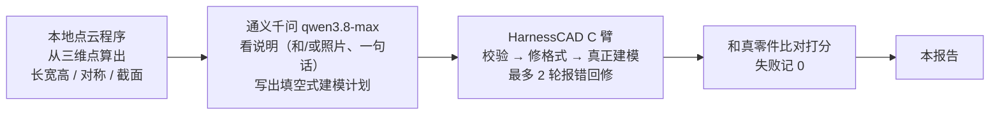
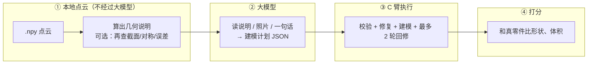
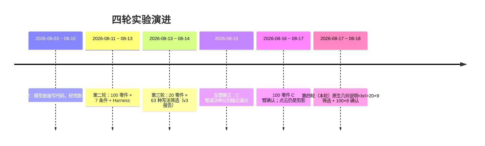
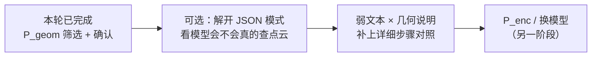

# 多模态 CAD 生成实验报告（v4 · 原生点云几何证据）

> **报告日期**：2026-08-18
> **主题**：点云不要再画成剪影给 AI 看，改成本地算出长宽高、对称、截面，直接写进提示词——这样画出来的零件会不会更像？
> **本版与上一版（v3）的区别**：v3 是 20 零件 × 63 种「文本/图片/点云画法」筛选，当时点云仍然是四张投影图。本版在 **Harness 已经冻成 C 臂**（成功率接近满分）之后，专门测「原生几何说明」相对「旧剪影」有没有用。
> **读者定位**：完全不了解本项目的读者也能看懂；专业词都配了白话解释。配对对比是探索性的，**不做显著性宣称**。

---

## 0. 30 秒读懂这份报告

**一句话**：外部大模型接口吃不进原始点云。我们改成「本地先从点云量出事实，再把事实写成说明给模型」。在 100 个零件上，这种几何说明比旧剪影平均高约 **0.19 分**；叠上照片大约 **0.54 分**。模型一次都没主动追问细节——变好靠的是一开始就写进去的那份说明，不是交互查询。

| 关键数字 | 含义 |
|---|---|
| **180 + 800** | 先 20 零件 × 9 种给法筛选，再 100 零件 × 8 种给法确认 |
| **99%+** | 确认阶段几乎都能画出零件（Harness 已冻成 C 臂） |
| **0.545** | 确认最高档平均总分：一句话 + 照片 + 几何说明 |
| **+0.186** | 几何说明相对旧剪影（100 个零件上，70 胜 28 负 2 平） |
| **+0.024** | 负向对照：照片再叠旧剪影，几乎没帮助 |
| **0 次** | 300 个「允许查点云」的任务里，模型一次都没查 |



---

## 1. 我们在研究什么问题（背景）

### 1.1 上一轮已经解决了什么

到 v3 / C 臂确认实验为止：

- 模型不再直接写代码，而是填一份受约束的建模计划；
- 格式不对、执行崩溃，可以把报错贴回去让它改（最多两轮）；
- 100 个零件 × 7 种模态上，成功率从大约 69% 拉到 **97.6%**。

**「画不出来」已经不是主矛盾。** 接下来要问：在几乎都能画出来的前提下，**点云这种三维信息到底有没有用对。**

### 1.2 旧点云其实不是点云

上一轮所谓的点云，是把几千个三维点 **画成四张图**（深度轮廓那种剪影）再塞给模型。接口本来就不收 `.npy` 点云。重算 C 臂上的旧结果后发现：照片再叠这种剪影，**几乎没有正的互补**——不是点云没价值，是「画成图」这条路把三维事实弄丢了。

### 1.3 本轮换了一种喂法

本地程序直接读点云，算出包围盒、主方向、对称、截面等，写成一份结构化说明（PointEvidence）。模型看到的是文字事实，不是剪影。必要时允许它再查一眼（截面、对称、和当前模型比误差），但查不查由它自己决定。

三种点云不要混：

| 叫法 | 实际是什么 | 本轮做了吗 |
|---|---|---|
| 旧剪影 `P_proj` | 点云画成图 | ✅ 对照 |
| 几何说明 `P_geom` | 本地算出事实再写入提示词 | ✅ 本轮主角 |
| 神经编码器 `P_enc` | 把点云变成模型内部向量 | ❌ 没做，以后才做 |

**不能说成「通义千问直接看懂了原生点云向量」。** 它看懂的是本地程序写好的说明。

### 1.4 完整流水线



> 几何说明在生成前 **不能偷看** 真实零件的 STEP / 源码 / 尺寸表，只用当前任务的点云。真实零件只在最后打分时出现。

### 1.5 项目时间线



---

## 2. 这个实验是怎么设计的（计划 vs 实际）

### 2.1 本轮要回答的问题

Harness 固定不动，只改「点云怎么告诉模型」：

1. 几何说明是不是比旧剪影更有用？
2. 已经有照片时，再加几何说明，是不是比再加旧剪影更有用？
3. 文本只有普通用户那句短描述时，几何说明能不能补上形状和尺寸？
4. 让模型按需查询，是不是比一次性塞完整说明更好？

### 2.2 计划 vs 实际执行

| # | 计划 | 实际 | 状态 |
|---|---|---|---|
| 1 | Harness 冻成 C 臂（v3 提示词 + R4 修复 + 2 轮反馈） | 筛选和确认都固定 C 臂 | ✅ |
| 2 | 先离线审计几何说明准不准 | 20 个零件：包围盒 100%、主轴 100%、截面 95%、对称 95%，门禁通过 | ✅ |
| 3 | 20×9 筛选 | 180 任务，204 次接口，约 1.8 小时 | ✅ |
| 4 | 按筛选结果冻结条件，去掉几乎无差异的静态档 | 去掉「几何说明(静态)」，确认跑 8 条件 | ✅ |
| 5 | 100×8 确认，样本与 C 臂确认同一批 | `pilot_v2` 的 100 条清单 | ✅ |
| 6 | 失败记 0 的总分 + 预注册配对 | 见 §4 | ✅ |
| 7 | 工具调用次数照实记录 | **0 次**，负结果保留 | ✅ |
| 8 | 不做神经编码器、不换模型、不加密点云 | 未做 | ✅ 按计划不做 |

### 2.3 8 种给法长什么样

```
  照片 I1          点云怎么说              文本
  有 / 无          不给 / 旧剪影 / 几何说明   不给 / 一句话 T1
```

| 条件 | 白话 |
|---|---|
| `I1` | 只给 4 张照片 |
| `P_proj` | 只给旧剪影 |
| `P_geom_tool` | 只给几何说明（允许再查，但模型没查） |
| `I1P_proj` | 照片 + 旧剪影 |
| `I1P_geom` | 照片 + 几何说明 |
| `T1I1` | 一句话 + 照片 |
| `T1I1P_proj` | 一句话 + 照片 + 旧剪影 |
| `T1I1P_geom` | 一句话 + 照片 + 几何说明 |

筛选阶段多一档 `P_geom_static`：几何说明写死、不允许再查。它和「允许再查」几乎同分，确认阶段为了省钱去掉了。

注意：确认清单里的照片是这 100 条样本自带的渲染图，**不是**编码筛选那 20 条上的正交照片。一句话文本是弱描述 `T1`，不是上一轮那种详细步骤 `T2`。

### 2.4 执行概况

| 项目 | 筛选 20×9 | 确认 100×8 |
|---|---|---|
| 任务数 | 180 | 800 |
| 模型 | qwen3.8-max | 同左 |
| 接口次数 | 204 | 合计 949（含断点续跑） |
| 耗时 | 约 1.8 小时 | 末次续跑约 4.7 小时（间隔 5 秒） |
| 画出来 | 176 成功 / 3 失败 / 1 跳过 | 795 成功 / 5 失败 |
| 工具查询 | 0 / 60 | 0 / 300 |

---

## 3. 我们用什么标准打分（大白话）

每个任务仍闯四关：计划能不能读懂 → 格式合不合规 → 能不能建出零件 → 建出来和真的像不像。**任一关失败，总分记 0。**

| 指标 | 白话 | 方向 |
|---|---|---|
| **成功率** | 有没有真正建出有效零件 | 越高越好 |
| **总分 joint quality（主指标）** | 把「表面差多远」和「体积叠了多少」合成 0～1；失败记 0 | 越高越好 |
| **表面误差 CD** | 两个零件表面平均差多远（先缩放到最长边=1，只比形状） | 越低越好 |
| **体积重合 IoU** | 切成小方块后，重合的比例 | 越高越好 |
| **F1@1%** | 表面上有多少点落在「最长边的 1%」这么严的容差里 | 越高越好，本轮数字会很难看 |
| **接口次数 / token** | 花了多少请求、多少字 | 越低越好 |
| **工具次数** | 模型主动查了几次点云 | 本轮全是 0 |

总分怎么合成（不必记公式，知道它是自制的就行）：

> 先把表面误差变成 0～1 的「像不像」，再乘 `(0.5 + 0.5 × 体积重合)`。完全重合不扣分；完全错开时形状分打对折。

**0.55 不是论文里的准确率，也不能直接和别人的 F1 榜单对拍。** 它是这次自己的平均总分，用来比较「给它看什么更好」。

---

## 4. 实验结果（确认 100 零件为主，筛选作对照）

### 4.1 问题一：8 种给法谁更高？


| 条件 | 白话 | 成功率 | 平均总分 | 中位总分 |
|---|---|---:|---:|---:|
| I1 | 只给照片 | 99% | 0.253 | 0.174 |
| T1I1 | 一句话 + 照片 | 97% | 0.246 | 0.187 |
| P_proj | 只给旧剪影 | 100% | 0.309 | 0.235 |
| I1P_proj | 照片 + 旧剪影 | 99% | 0.277 | 0.193 |
| T1I1P_proj | 一句话 + 照片 + 旧剪影 | 100% | 0.293 | 0.234 |
| P_geom_tool | 只给几何说明 | 100% | **0.495** | 0.485 |
| I1P_geom | 照片 + 几何说明 | 100% | **0.544** | 0.602 |
| T1I1P_geom | 一句话 + 照片 + 几何说明 | 100% | **0.545** | 0.559 |

读表要点：

- 本轮几乎都能画出来，**拉开差距的不是成功率，是像不像**。
- 只给几何说明（0.495）已经明显高于只给照片（0.253）和只给旧剪影（0.309）。
- 照片或一句话再叠几何说明，还能再抬到约 **0.54**。
- 照片再叠旧剪影（0.277）几乎没比纯照片好——和阶段 0、v3 的结论一致。

### 4.2 问题二：同一零件上，换给法会好多少？


失败记 0，n=100。区间是 95% 分位，**探索性，不宣称显著**。

| 对比 | 平均差 | 95% 区间 | 赢 / 输 / 平 |
|---|---:|---|---:|
| 几何说明 − 旧剪影 | **+0.186** | [0.136, 0.238] | 70 / 28 / 2 |
| 照片+几何 − 照片+旧剪影 | **+0.267** | [0.209, 0.327] | 76 / 21 / 3 |
| 照片+几何 − 纯照片 | **+0.291** | [0.234, 0.349] | 83 / 15 / 2 |
| 一句话+照片+几何 − 一句话+照片 | **+0.299** | [0.242, 0.356] | 81 / 17 / 2 |
| 一句话+照片+几何 − 一句话+照片+旧剪影 | **+0.252** | [0.196, 0.311] | 79 / 19 / 2 |
| 照片+旧剪影 − 纯照片（负向对照） | +0.024 | [0.001, 0.049] | 45 / 36 / 19 |

两边都画成功时再算一遍，数字几乎不动（几何说明 − 旧剪影仍是 +0.186）。  
**变好主要是「画出来的零件更像」，不是「多救回了几个失败」。** 因为失败本来就只剩几个。

补充（计划里也要求看、但确认报告主表没单列）：照片+几何相对「只给几何说明」大约 **+0.05**（56 胜 42 负），有一点加分，但远小于「几何说明相对旧剪影」那一截。一句话再叠上去，和「照片+几何」几乎打平（差 0.001）。

### 4.3 问题三：20 个零件上的方向，100 个上还在吗？


| 条件 | 筛选 n=20 | 确认 n=100 |
|---|---:|---:|
| 照片 | 0.317 | 0.253 |
| 旧剪影 | 0.276 | 0.309 |
| 几何说明 | 0.501 | 0.495 |
| 照片+旧剪影 | 0.390 | 0.277 |
| 照片+几何 | 0.593 | 0.544 |
| 一句话+照片 | 0.302 | 0.246 |
| 一句话+照片+旧剪影 | 0.293 | 0.293 |
| 一句话+照片+几何 | 0.597 | 0.545 |

筛选里「几何说明 − 旧剪影」是 +0.225（17 胜 3 负）；确认收到 **+0.186**（70 胜 28 负）。方向没翻，幅度略收——20 个零件的试跑没有把效果吹过头到不可复核。

筛选里多测的「允许再查 vs 写死说明」差 **+0.003**（5 胜 5 负 10 平），等于同一输入。确认阶段按计划丢掉写死档。

### 4.4 问题四：简单零件才有效，还是难的也有效？


确认集：简单 26、中等 38、困难 36。

| 难度 | 照片 | 旧剪影 | 几何说明 | 照片+几何 | 一句话+照片+几何 |
|---|---:|---:|---:|---:|---:|
| 简单 | 0.229 | 0.286 | 0.500 | 0.572 | **0.625** |
| 中等 | 0.251 | 0.341 | 0.551 | 0.538 | 0.513 |
| 困难 | 0.274 | 0.292 | 0.432 | 0.532 | 0.522 |

三种难度上，带几何说明的档都高于照片和旧剪影。简单零件上「一句话+照片+几何」最高（0.625）；困难零件上几何说明单用会掉到 0.432，但叠照片仍能到 0.53 左右。

### 4.5 问题五：是「更能跑通」还是「跑通了更像」？


- 八个条件成功率都在 97%～100%。v3 里那种「加模态就更容易写坏格式」的现象，在 C 臂冻住之后基本消失。
- 旧剪影：100 个里 45 个总分低于 0.2，只有 5 个高于 0.8。
- 几何说明：低于 0.2 的减到 10 个，高于 0.8 的 15 个。
- 一句话+照片+几何：32 个高于 0.8，18 个仍低于 0.2——**平均 0.55 是「一批很像、一批仍然不像」拉出来的，不是每个零件都中等偏上。**

### 4.6 问题六：多花的 token 换来质量了吗？


| 条件 | 平均提示词 token | 平均回复 token | 平均接口次数 | 总分 |
|---|---:|---:|---:|---:|
| 旧剪影 | 2,638 | 471 | 1.04 | 0.309 |
| 几何说明 | 3,418 | 316 | 1.02 | **0.495** |
| 照片 | 5,811 | 703 | 1.17 | 0.253 |
| 照片+几何 | 7,838 | 724 | 1.15 | **0.544** |
| 一句话+照片+几何 | 7,854 | 743 | 1.27 | **0.545** |

- 几何说明比旧剪影只多大约 800 个提示词 token，总分却高 0.19——**性价比最好的一档就是「只给几何说明」。**
- 涨成本的是照片（一张图就要很多 token）。叠照片能再换大约 +0.05 分，值不值得看预算。
- 一句话几乎不额外加分，也几乎不省钱（照片还在）。

确认 800 个任务合计约 **529 万 token**（提示词 476 万 + 回复 53 万）。

### 4.7 问题七：模型有没有主动查点云？

**没有。筛选 60 次、确认 300 次，查询次数全部是 0。**

原因很具体：当前是 JSON 模式，模型直接交建模计划，不会先发「我要查截面」这种请求。所以「允许再查」这一档，实际吃到的输入就是静态说明。

这是预注册假设 H-PC4 的负结果，必须保留：本轮 **不能** 说「交互式点云工具提高了质量」。

### 4.8 目前生成水平：0.55 意味着什么，离论文数字差多少？


以确认最高档（一句话+照片+几何，画成功的零件）为例：

| 口径 | 本轮最好档 | 怎么读 |
|---|---|---|
| 自制总分 | 平均 0.545，中位 0.559 | 100 个零件的平均像样程度，失败很少、拉分主要靠像不像 |
| 表面误差 | 约 **0.12**（最长边的 12%） | 100 mm 的零件，表面平均大概偏 12 mm 量级 |
| 体积重合 | 约 **0.55** | 体积大约叠一半 |
| F1@1% | 约 **0.17** | 1% 容差极严，这个数会很难看，不宜直接贴论文榜单 |

和专门训练的 CAD 生成论文（常见表面误差大约是最长边的 3% 上下）比：我们大概差 **3～4 倍的表面误差**。任务也不一样——他们多是为 CAD 步骤专门训练的模型；我们是通用大模型看说明再建模。

怎么理解这个水平：

- **已经能做到**：在几乎总能画出来的前提下，把几何事实写进提示词，能把一批零件从「轮廓勉强对」推进到「体积能叠一半、不少能到 0.8 分以上」；
- **还做不到**：细特征（孔、齿、倒角）仍经常错；大约两成零件仍然很差；离工业可用差一档，也还没碰到论文里那些专用模型的表面误差量级。

---

## 5. 预注册假设对照

实验开始前写在计划里的四条，现在用确认数字回答。配对是探索性的，这里只判「方向是否支持」，不说「统计显著」。

| 假设 | 判定 | 依据 |
|---|---|---|
| **H-PC1**：几何说明比旧剪影更有利于恢复几何 | ✅ **方向支持** | 总分 +0.186（70/28/2）；表面误差 0.112 vs 0.237；体积重合 0.47 vs 0.26 |
| **H-PC2**：有照片时，加几何说明比加旧剪影收益更大，且同时优于纯照片、优于纯几何说明 | ✅ **方向支持** | 相对照片+旧剪影 +0.267；相对纯照片 +0.291；相对纯几何说明约 +0.05 |
| **H-PC3**：弱文本下一加几何说明，增益会大于强文本场景 | 🟡 **本轮只能部分对照** | 弱文本增益 +0.299；本轮矩阵里没有「详细步骤 + 几何说明」。C 臂上详细文本再叠旧剪影几乎没增益。方向吻合，但缺同一套几何说明上的强文本对照 |
| **H-PC4**：按需查询优于一次性塞完整说明 | ❌ **不成立** | 工具 0 次；筛选里两档差 +0.003 |

阶段 0 的负向对照仍然成立：旧剪影叠照片几乎无互补（确认 +0.024）。

---

## 6. 核心结论（大白话）

1. **点云真正有用的方式，是把三维事实写清楚，而不是画成剪影。** 同样 100 个零件，几何说明比旧剪影高大约 0.19 分。
2. **照片再叠旧剪影几乎白加；照片再叠几何说明很值。** 负向对照只有 +0.024，正向大约 +0.29。
3. **弱文本挡不住几何说明。** 一句话 + 照片本身只有 0.25，加上几何说明到 0.55。普通用户不会写详细步骤时，这份说明最值钱。
4. **变好不是因为更能跑通。** C 臂已经把成功率托到 97% 以上；增益来自画出来的形状更像。
5. **交互查询本轮没发生。** 不许写成「模型会主动查点云所以更好」。
6. **0.55 是自制平均分，不是论文准确率。** 跟文献比应看表面误差大约 12% vs 常见约 3%，大概差一档。

计划允许的表述：

> 在外部接口不支持原生点云向量的条件下，我们用本地三维工具和结构化说明，让系统用上了点云的坐标、对称和截面；Harness 固定之后，这种方式相对点云二维投影提高了几何质量，并在照片或弱文本信息不足时表现出互补。

不允许的表述：

> 闭源通义千问直接理解了原生点云 embedding。

---

## 7. 局限与注意事项

- 确认配对是探索性的，**没有做正式显著性检验 / Holm 校正**，也没有按计划重复 3 次；
- 确认照片来自 100 样本清单的渲染图，和编码筛选 20 条上的正交照片不是同一套；
- 文本只有弱描述 T1，没有在本轮重跑详细步骤 T2 + 几何说明；
- 点云密度固定在现有 2048，没有做 8192 密度臂；
- 只测了通义千问 + JSON 模式；换模型、关掉 JSON 模式，工具会不会被调用，不知道；
- 几何说明本身在 20 个零件上审计过，100 个确认集没有再做一遍 GT 对账；
- 不能外推到「把点云编码进模型内部」的 P_enc。

---

## 8. 下一步建议



1. 若还关心 H-PC4：需要改协议（不要逼模型第一下就交计划），否则工具档永远等于静态档。
2. 若还关心 H-PC3 的完整对照：用同一 100 样本加跑「详细步骤 + 几何说明」。
3. 神经点云编码、加密采样、换 GPT/Claude，按原计划仍属后续阶段。

---

## 附录 A. 数据与复现文件

| 内容 | 路径 |
|---|---|
| 本报告 | `experiments/rq2_multimodal_harness/EXPERIMENT_REPORT_V4_ZH.md` |
| 上一版（编码筛选 + 反馈摘要） | `EXPERIMENT_REPORT_V3_ZH.md` |
| 筛选配置 / 确认配置 | `configs/pc_geom_screen.yaml`、`configs/pc_geom_confirm.yaml` |
| 筛选汇总 | `outputs/native_pointcloud_v1/run_summary.json` |
| 确认汇总 | `outputs/native_pointcloud_v1/confirm_n100/run_summary.json` |
| 筛选中文报告 | `outputs/native_pointcloud_v1/analysis/NATIVE_POINTCLOUD_SCREEN_REPORT_ZH.md` |
| 确认中文报告 | `outputs/native_pointcloud_v1/confirm_n100/analysis/NATIVE_POINTCLOUD_CONFIRM_REPORT_ZH.md` |
| 阶段 0（旧剪影在 C 臂上几乎无互补） | `outputs/native_pointcloud_v1/analysis/phase0/P0_CARM_REANALYSIS_ZH.md` |
| 几何说明离线审计 | `outputs/native_pointcloud_v1/analysis/phase2/EVIDENCE_AUDIT_ZH.md` |
| 本报告图表 | `outputs/native_pointcloud_v1/confirm_n100/analysis/figures/report_v4/` |
| 图表脚本 | `scripts/make_report_v4_figures.py` |
| 实验计划（未改） | `NATIVE_POINT_CLOUD_API_EXPERIMENT_PLAN_ZH.md` |

## 附录 B. 术语速查

| 术语 | 含义 |
|---|---|
| C 臂 | 已经冻住的执行设定：v3 提示词 + 格式修复 + 最多 2 轮报错回修 |
| Plan | 模型填的结构化建模计划，不是任意代码 |
| HarnessCAD | 校验、修复、编译、真正建模的执行层 |
| 旧剪影 `P_proj` | 把点云画成深度轮廓图再给模型 |
| 几何说明 `P_geom` | 本地从点云算出的长宽高、对称、截面等文字事实 |
| 总分 joint quality | 自制 0～1 综合分，失败记 0 |
| 赢/输/平 | 同一批零件上 A 比 B 好 / 差 / 一样的个数 |
| token | 模型和账单用的「字数」单位；图比纯文字贵得多 |

---

*报告生成：2026-08-18。数据来源：`outputs/native_pointcloud_v1` 筛选 180 任务与 `confirm_n100` 确认 800 任务；图表由 `make_report_v4_figures.py` 从分析 CSV 直接生成，未手工改数。配对对比探索性，不做显著性宣称。*
