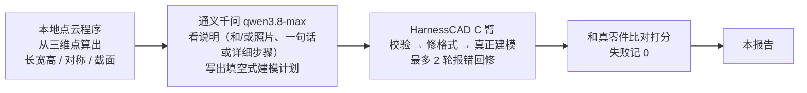
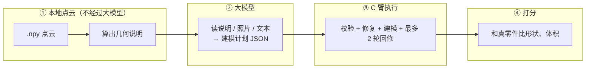
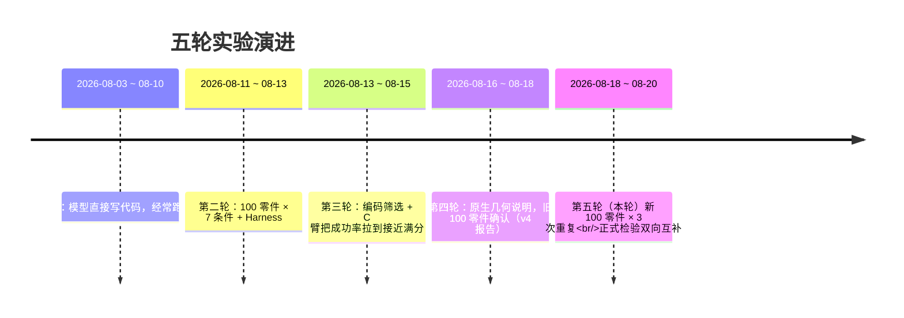
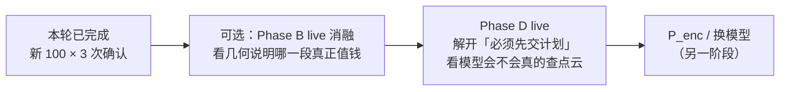

# 多模态 CAD 生成实验报告（v5 · 信息缺口驱动的条件性互补）

> **报告日期**：2026-08-20
> **主题**：几何说明已经比旧剪影强了——再换一批零件、加上重复和正式统计，它和照片、详细文本到底是互相帮忙，还是谁叠谁都差不多？
> **本版与上一版（v4）的区别**：v4 在旧 100 零件上探索性地看到「几何说明比剪影更有用」。本版换 **新的 100 零件**（与旧 100 无重叠），每个核心条件跑 **3 次**，预注册 8 个对比并做 **Holm 校正**；补上了 v4 缺的「详细步骤 × 几何说明」和「错配几何」负向对照。
> **读者定位**：完全不了解本项目的读者也能看懂；专业词都配了白话解释。本轮配对对比按预注册做了显著性校正，**可以报告 Holm 后的正式结果**。

---

## 0. 30 秒读懂这份报告

**一句话**：同样是通义千问 + 已经冻住的执行层，把点云先在本地量成「长宽高 / 对称 / 截面」写进提示词，再叠照片，比只给照片平均高约 **0.26 分**，也比只给几何说明再高约 **0.06 分**——两边都更好，叫双向互补；但照片叠上去的那一截比较小。错配别人的几何说明、或改回旧剪影，都明显变差。模型仍然一次都没主动追问点云。

| 关键数字 | 含义 |
|---|---|
| **2600** | 新 100 零件 ×（8 种给法 × 3 次 + 2 个对照） |
| **98.3%～100%** | 各条件几乎都能画出零件 |
| **0.545** | 照片 + 几何说明的平均总分（最高档之一） |
| **+0.259** | 照片+几何 相对 纯照片（C2，Holm p&lt;0.001） |
| **+0.057** | 照片+几何 相对 纯几何说明（C3，Holm p=0.006） |
| **58 / 100** | 零件级：同时比纯照片和纯几何说明更好 |
| **+0.202** | 正确几何说明明显好于「张冠李戴」的错配说明 |



---

## 1. 我们在研究什么问题（背景）

### 1.1 上一轮已经解决了什么

到 v4 为止：

- 执行层冻成 **C 臂**（填空式计划 + 格式修复 + 最多两轮报错回修），成功率接近满分；
- 点云不再画成剪影，改成本地算出的几何说明；
- 在 **旧 100 零件** 上，几何说明比旧剪影大约高 0.19 分，照片再叠几何说明到大约 0.54 分。

**「画不出来」和「剪影有没有用」已经有答案。** 接下来要问的是更硬的一句：

> 几何说明是不是在 **新零件、重复实验、正式统计** 下仍然成立？它和照片、详细文本是双向互补，还是只是「谁叠上去都加点分」？

### 1.2 什么叫双向互补（大白话）

不要把「模态越多越好」当成结论。本轮事先写好的标准是：

- 照片已经有了，再加几何说明，必须明显更好（点云补图像）；
- 几何说明已经有了，再加照片，也必须明显更好（图像补点云）；
- **两条同时成立**，才叫双向互补。只过一侧，叫单向补强。

另外还要排除两种假象：

- 不是任何「再贴一张点云图」都有用——旧剪影对照必须更差；
- 不是任何「几何口吻的说明」都有用——把 A 零件的说明贴到 B 零件上（错配）必须更差。

### 1.3 三种点云不要混

| 叫法 | 实际是什么 | 本轮做了吗 |
|---|---|---|
| 旧剪影 `P_proj` | 点云画成图 | ✅ 对照 |
| 几何说明 `P_geom` | 本地算出事实再写入提示词（完整档 `P_full`） | ✅ 本轮主角 |
| 错配几何 `I1P_shuffle` | 照片对，说明却是另一个零件的 | ✅ 负向对照 |
| 神经编码器 `P_enc` | 把点云变成模型内部向量 | ❌ 没做，以后才做 |

**不能说成「通义千问直接看懂了原生点云向量」。** 它看懂的是本地程序写好的说明。

### 1.4 完整流水线



> 几何说明在生成前 **不能偷看** 真实零件的 STEP / 源码 / 尺寸表，只用当前任务的点云。真实零件只在最后打分时出现。

### 1.5 项目时间线



---

## 2. 这个实验是怎么设计的（计划 vs 实际）

### 2.1 本轮要回答的问题

Harness 固定不动，只改「给模型看什么」，并换一批零件：

1. 几何说明相对旧剪影的优势，在新 100 上还在不在？（C1）
2. 有照片时再加几何说明，有没有增益？（C2）
3. 已有几何说明时再加照片，有没有增益？（C3）——和 C2 同时成立才算双向互补
4. 文本很弱（一句话）时，几何说明是不是特别有用？（C4）
5. 文本已经很强（详细步骤）时，几何说明还有没有用？（C5）
6. 弱文本下的增益，是不是大于强文本下的增益？（C6）
7. 这不是「再贴一张剪影」的假象吧？（C7）
8. 这不是「任何几何口吻的套话」的假象吧？（C8）

### 2.2 计划 vs 实际执行

| # | 计划 | 实际 | 状态 |
|---|---|---|---|
| 1 | 先用 v4 旧确认里 **没参与筛选的 80 个零件** 做零接口重分析，主效应不能翻负 | `P_geom − P_proj` ΔJQ = +0.182，区间 [0.125, 0.241] | ✅ Phase A 过门 |
| 2 | 几何说明组成先冻结为完整档 `P_full` | 写入 `p_geom_freeze.json`；20×6 消融只做了 dry-run，**未另开 live** | ✅ 按默认冻结 |
| 3 | 新 100 分层抽样，与旧 100 / 筛选 20 无重叠；排除无效 GT | `manifest_new100.jsonl`，seed=20260818；3 个无效 STEP 已替换 | ✅ |
| 4 | 开跑前离线审计新 100 的几何说明 | 包围盒 100%、主轴 100%、截面 87%、对称 97%，门禁通过 | ✅ |
| 5 | 预注册 C1–C8、失败记 0、三次重复、对照只跑 1 次 | 见 §4、§5 | ✅ |
| 6 | Harness 冻成 C 臂；模型 `qwen3.8-max`；两次请求开始间隔 ≥5 秒 | 全程同一套 | ✅ |
| 7 | 输出与 v4 分开，不改 C 臂语义、不改 v4 状态文件 | `outputs/v5_complementarity/` | ✅ |
| 8 | 交互查询另开 Phase D，不和确认混写 | `tool_study/` 仅 dry-run，**未开 live** | ✅ 按计划不做混写 |
| 9 | 不做神经编码器、不换模型 | 未做 | ✅ 按计划不做 |

执行中有一次账号欠费：全量末尾 101 条返回 `overdue-payment`。充值后续跑，101 条全部补成 completed。正式数字以补齐后的 2600 条为准。

### 2.3 10 种给法长什么样

```
  照片 I1          点云怎么说                    文本
  有 / 无          不给 / 旧剪影 / 几何说明 / 错配   不给 / 一句话 T1 / 详细步骤 T2
```

| 条件 | 白话 | 重复 |
|---|---|---|
| `I1` | 只给 4 张照片 | 3 次 |
| `P_proj` | 只给旧剪影 | 3 次 |
| `P_geom` | 只给几何说明 | 3 次 |
| `I1P_geom` | 照片 + 几何说明 | 3 次 |
| `T1I1` | 一句话 + 照片 | 3 次 |
| `T1I1P_geom` | 一句话 + 照片 + 几何说明 | 3 次 |
| `T2I1` | 详细步骤 + 照片 | 3 次 |
| `T2I1P_geom` | 详细步骤 + 照片 + 几何说明 | 3 次 |
| `I1P_proj` | 照片 + 旧剪影（负向对照） | 仅 1 次 |
| `I1P_shuffle` | 照片 + **别人的**几何说明（负向对照） | 仅 1 次 |

注意：照片是该样本自带 RGB 四视图；一句话是弱描述 `T1`，详细步骤是编码实验同口径的 `T2`，现场没有新写提示词。

### 2.4 执行概况

| 项目 | Phase A | Phase B | Phase C 确认 |
|---|---|---|---|
| 内容 | 旧确认 held-out 80 重分析 | 旧 20 上消融组成（dry-run） | 新 100 × 10 条件 |
| 接口 | 0 | 0（live 未开） | 全量 + 补跑 |
| 任务数 | — | 120 dry-run | **2600** |
| 模型 | — | — | qwen3.8-max |
| 画出来 | — | — | 2580 成功 / 18 执行失败 / 2 解析失败 |
| 耗时 | 秒级 | — | 全量约 15.7 小时 + 补跑约 48 分钟 |

---

## 3. 我们用什么标准打分（大白话）

每个任务仍闯四关：计划能不能读懂 → 格式合不合规 → 能不能建出零件 → 建出来和真的像不像。**任一关失败，总分记 0。**

分析时先对同零件、同条件的三次重复取平均，再拿 100 个零件做配对。对照条件只有 1 次，就用那 1 次。

| 指标 | 白话 | 方向 |
|---|---|---|
| **成功率** | 有没有真正建出有效零件 | 越高越好 |
| **总分 joint quality（交付主指标）** | 把「表面差多远」和「体积叠了多少」合成 0～1；失败记 0 | 越高越好 |
| **common-frame CD（几何主口径）** | 两个零件放到同一坐标系后，表面平均差多远 | 越低越好 |
| **表面误差 shape-only CD** | 先缩放到最长边=1，只比形状 | 越低越好 |
| **体积重合 IoU** | 切成小方块后，重合的比例 | 越高越好 |
| **F1@1%** | 表面上有多少点落在「最长边的 1%」这么严的容差里 | 越高越好，数字会很难看 |
| **Holm p** | 8 个预注册对比一起校正后的 p 值 | 小于 0.05 视为本轮正式显著 |

总分怎么合成（不必记公式，知道它是自制的就行）：

> 先把表面误差变成 0～1 的「像不像」，再乘 `(0.5 + 0.5 × 体积重合)`。完全重合不扣分；完全错开时形状分打对折。

**0.55 不是论文里的准确率，也不能直接和别人的 F1 榜单对拍。** 它是这次自己的平均总分，用来比较「给它看什么更好」。

---

## 4. 实验结果（新 100 零件，三次重复先取均值）

### 4.1 问题一：10 种给法谁更高？


| 条件 | 白话 | n | 成功率 | 平均总分 | 中位总分 |
|---|---|---:|---:|---:|---:|
| I1 | 只给照片 | 300 | 99.7% | 0.285 | 0.239 |
| T1I1 | 一句话 + 照片 | 300 | 99.3% | 0.316 | 0.272 |
| T2I1 | 详细步骤 + 照片 | 300 | 98.7% | 0.497 | 0.449 |
| P_proj | 只给旧剪影 | 300 | 99.3% | 0.352 | 0.297 |
| I1P_proj | 照片 + 旧剪影 | 100 | 100% | 0.310 | 0.270 |
| I1P_shuffle | 照片 + 错配几何 | 100 | 100% | 0.343 | 0.341 |
| P_geom | 只给几何说明 | 300 | **100%** | **0.488** | 0.491 |
| I1P_geom | 照片 + 几何说明 | 300 | 99.7% | **0.545** | 0.587 |
| T1I1P_geom | 一句话 + 照片 + 几何 | 300 | 98.3% | **0.527** | 0.551 |
| T2I1P_geom | 详细步骤 + 照片 + 几何 | 300 | 98.3% | **0.554** | 0.551 |

读表要点：

- 本轮几乎都能画出来，**拉开差距的不是成功率，是像不像**。
- 只给几何说明（0.488）已经明显高于只给照片（0.285）和只给旧剪影（0.352）。
- 照片再叠几何说明，到 **0.545**；再换成详细步骤，只再抬到 0.554，几乎打平。
- 照片再叠旧剪影（0.310）或错配几何（0.343），都远远低于正确的几何说明。
- 详细步骤本身已经很强（0.497），说明「文本写细」这条杠杆 v3 里见过的，本轮还在。

### 4.2 问题二：同一零件上，换给法会好多少？（C1–C8，Holm）


失败记 0，n=100。区间是 bootstrap 95%；p 值做 Holm 校正。

| ID | 对比 | 平均差 | 95% 区间 | 赢 / 输 / 平 | Holm p | 判定 |
|---|---|---:|---|---:|---:|---|
| C1 | 几何说明 − 旧剪影 | **+0.136** | [0.083, 0.190] | 66 / 34 / 0 | &lt;0.001 | 表示优势成立 |
| C2 | 照片+几何 − 纯照片 | **+0.259** | [0.206, 0.315] | 84 / 16 / 0 | &lt;0.001 | 点云补图像 |
| C3 | 照片+几何 − 纯几何说明 | **+0.057** | [0.012, 0.102] | 62 / 38 / 0 | **0.006** | 图像补点云（弱） |
| C4 | 弱文本下加几何 | **+0.211** | [0.158, 0.267] | 77 / 23 / 0 | &lt;0.001 | 弱文本增益大 |
| C5 | 强文本下加几何 | **+0.057** | [0.024, 0.094] | 61 / 39 / 0 | 0.008 | 强文本仍有增益 |
| C6 | (C4) − (C5) | **+0.154** | [0.097, 0.212] | 71 / 29 / 0 | &lt;0.001 | 文本越弱，点云越有用 |
| C7 | 照片+几何 − 照片+旧剪影 | **+0.234** | [0.182, 0.289] | 80 / 20 / 0 | &lt;0.001 | 不是投影伪增益 |
| C8 | 照片+几何 − 照片+错配几何 | **+0.202** | [0.158, 0.249] | 82 / 18 / 0 | &lt;0.001 | 不是错配套话 |

**预注册判定：C2 与 C3 同时为正，且 Holm 后区间不跨 0 → 双向互补成立。**  
C3 是最弱一环：平均只高 0.057，62 胜 38 负。点云结构化证据已经覆盖了大部分几何信息，照片是锦上添花，不是另一半。

成功率的 McNemar 检验全部不显著。  
**变好主要是「画出来的零件更像」，不是「多救回了几个失败」。**

零件级（100 个里有多少同时满足「照片+几何 > 纯照片」且「照片+几何 > 纯几何」）：

| 类型 | 个数 |
|---|---:|
| 双向互补 | **58** |
| 只强于纯照片 | 26 |
| 只强于纯几何说明 | 4 |
| 两边都不强 | 12 |

### 4.3 问题三：旧 100 上的方向，新 100 上还在吗？


两批零件 **没有交集**，不是同一 100 的重复测量。

| 条件 | V4 旧 100 | V5 新 100 |
|---|---:|---:|
| 照片 | 0.253 | 0.285 |
| 一句话+照片 | 0.246 | 0.316 |
| 旧剪影 | 0.309 | 0.352 |
| 照片+旧剪影 | 0.277 | 0.310 |
| 几何说明 | 0.495 | 0.488 |
| 照片+几何 | 0.544 | 0.545 |
| 一句话+照片+几何 | 0.545 | 0.527 |

| 对比 | V4 旧 100 | V5 新 100 |
|---|---:|---:|
| 几何说明 − 旧剪影 | +0.186 | +0.136 |
| 照片+几何 − 纯照片 | +0.291 | +0.259 |
| 一句话+照片+几何 − 一句话+照片 | +0.299 | +0.211 |

方向没有翻。新集上「几何说明相对旧剪影」收了一截（+0.19 → +0.14），符合换一批零件后的回归；**照片+几何的绝对水平几乎一样（0.544 vs 0.545）。**

Phase A 用旧确认里没进筛选的 80 个零件、零接口重算：几何说明 − 旧剪影仍是 +0.182。本轮 live 不是把已经看好的 20 个零件再跑一遍。

### 4.4 问题四：简单零件才有效，还是难的也有效？


新 100：简单 33、中等 33、困难 34。

| 难度 | 照片 | 旧剪影 | 几何说明 | 照片+几何 | 详细步骤+照片+几何 |
|---|---:|---:|---:|---:|---:|
| 简单 | 0.245 | 0.301 | 0.466 | 0.503 | 0.489 |
| 中等 | 0.365 | 0.410 | 0.498 | **0.600** | 0.582 |
| 困难 | 0.247 | 0.345 | 0.499 | 0.531 | **0.590** |

三种难度上，带几何说明的档都高于照片和旧剪影。中等零件上「照片+几何」最高（0.600）；困难零件上详细步骤再叠几何说明最高（0.590）。**不是只在简单件上才有效。**

### 4.5 问题五：是「更能跑通」还是「跑通了更像」？


- 十个条件成功率都在 98.3%～100%。v3 里那种「加模态就更容易写坏格式」的现象，在 C 臂冻住之后基本消失。
- 纯照片：100 个里 **44** 个总分低于 0.2，只有 **3** 个高于 0.8。
- 几何说明：低于 0.2 的减到 **5** 个，高于 0.8 的 **13** 个。
- 照片+几何：低于 0.2 的 **14** 个，高于 0.8 的 **24** 个。
- 平均 0.55 仍然是「一批很像、一批仍然不像」拉出来的，不是每个零件都中等偏上。

真正的模型/CAD 失败一共 **20** 条（18 次执行失败 + 2 次解析失败），约占 2600 的 0.8%。

### 4.6 问题六：多花的 token 换来质量了吗？


| 条件 | 平均提示词 token | 平均回复 token | 平均接口次数 | 总分 |
|---|---:|---:|---:|---:|
| 旧剪影 | 2,619 | 400 | 1.06 | 0.352 |
| 几何说明 | 2,940 | 352 | 1.01 | **0.488** |
| 照片 | 5,768 | 609 | 1.13 | 0.285 |
| 详细步骤+照片 | 6,005 | 713 | 1.26 | 0.497 |
| 照片+几何 | 7,645 | 601 | 1.09 | **0.545** |
| 详细步骤+照片+几何 | 7,431 | 685 | 1.25 | **0.554** |

- 几何说明比旧剪影只多大约 300 个提示词 token，总分却高 0.14——**性价比最好的一档仍是「只给几何说明」。**
- 涨成本的是照片。叠照片能再换大约 +0.06 分（C3），值不值得看预算。
- 详细步骤本身已经能把总分抬到约 0.50；再叠几何说明只再加 0.06，和 C5 一致。

### 4.7 问题七：模型有没有主动查点云？

**本轮确认矩阵里没有开交互查询协议。** 工具调用次数全部是 0。这是设计如此，不是又一次「允许查但模型没查」。

按预注册，交互查询放在独立的 Phase D（`query_or_submit` + 累积工具史），与确认矩阵分开写。Phase D 目前只做了 20×3 dry-run，**尚未 live**。因此本轮 **不能** 说「交互式点云工具提高了质量」，也还不能更新 v4 对 H-PC4 的否定。

### 4.8 目前生成水平：0.55 意味着什么，离论文数字差多少？


以确认高档（照片+几何说明，completed 的样本均值）为例：

| 口径 | 本轮照片+几何 | 怎么读 |
|---|---|---|
| 自制总分 | 平均 0.545，中位 0.587 | 100 个零件的平均像样程度，失败很少、拉分主要靠像不像 |
| common-frame CD | 约 **0.125** | 对齐后表面平均大约偏最长边的 12.5% |
| 体积重合 | 约 **0.56** | 体积大约叠一半出头 |
| F1@1% | 约 **0.16** | 1% 容差极严，这个数会很难看，不宜直接贴论文榜单 |

和专门训练的 CAD 生成论文（常见表面误差大约是最长边的 3% 上下）比：我们大概差 **3～4 倍的表面误差**。任务也不一样——他们多是为 CAD 步骤专门训练的模型；我们是通用大模型看说明再建模。

怎么理解这个水平：

- **已经能做到**：在几乎总能画出来的前提下，把几何事实写进提示词，能把一批零件从「轮廓勉强对」推进到「体积能叠一半、大约四分之一能到 0.8 分以上」；照片和几何说明可以互相补一点，但几何说明是大头；
- **还做不到**：细特征（孔、齿、倒角）仍经常错；大约一成多零件仍然很差；离工业可用差一档，也还没碰到论文里那些专用模型的表面误差量级。

---

## 5. 预注册假设对照

实验开始前写在 `preregistration.md` 里的 C1–C8，现在用新 100 的正式数字回答。与 v4 不同：本轮 **做了 Holm 校正，可以报告显著性**。

| 假设 | 判定 | 依据 |
|---|---|---|
| **C1**：几何说明比旧剪影更有利于恢复几何 | ✅ **成立** | ΔJQ +0.136，Holm p&lt;0.001，66/34 |
| **C2**：有照片时，加几何说明有增益 | ✅ **成立** | +0.259，Holm p&lt;0.001，84/16 |
| **C3**：有几何说明时，加照片有增益 | ✅ **成立（弱）** | +0.057，Holm p=0.006，CI [0.012, 0.102] |
| **双向互补** = C2 且 C3 | ✅ **成立** | 两条都为正且 Holm 后区间不跨 0；零件级 58/100 |
| **C4**：弱文本下点云增益大 | ✅ **成立** | +0.211，Holm p&lt;0.001 |
| **C5**：强文本下点云仍有增益 | ✅ **成立（弱）** | +0.057，Holm p=0.008 |
| **C6**：弱文本增益大于强文本增益 | ✅ **成立** | +0.154，Holm p&lt;0.001（v4 缺这一条完整对照） |
| **C7**：不是旧剪影假象 | ✅ **成立** | +0.234，Holm p&lt;0.001 |
| **C8**：不是错配套话 | ✅ **成立** | +0.202，Holm p&lt;0.001；停止条件「shuffle ≈ 正确证据」未触发 |

v4 的 H-PC4（按需查询优于一次性说明）本轮确认矩阵不检验；Phase D live 未开，维持 v4 的「本协议下工具 0 次」结论。

---

## 6. 核心结论（大白话）

1. **双向互补成立，但两边不对称。** 几何说明补照片很多（+0.26），照片补几何说明很少（+0.06）。大头是结构化几何事实，不是「再多看几张图」。
2. **点云真正有用的方式，仍然是把三维事实写清楚，而不是画成剪影、也不是随便写一份几何口吻的说明。** 旧剪影对照和错配对照都明显更差。
3. **文本越弱，几何说明越值钱。** 一句话场景加几何说明 +0.21；详细步骤已经写清时，只再加 +0.06。这支持「信息缺口」而不是「模态越多越好」。
4. **变好不是因为更能跑通。** C 臂已经把成功率托到 98% 以上；增益来自画出来的形状更像。
5. **换一批零件后，结论还在。** 照片+几何的平均总分几乎等于 v4 旧 100（0.545 vs 0.544）；几何说明相对旧剪影的优势收了一点，但 Holm 后仍显著。
6. **0.55 是自制平均分，不是论文准确率。** 跟文献比应看表面误差大约 12% vs 常见约 3%，大概差一档。
7. **交互查询本轮没测 live。** 不许写成「模型会主动查点云所以更好」。

计划允许的表述：

> 在外部接口不支持原生点云向量的条件下，我们用本地三维工具得到 point-cloud-derived structured geometric evidence。Harness 固定、换新 100 零件并做三次重复之后，这种方式相对点云二维投影和错配证据都提高了几何质量；与照片同时提供时表现为双向互补，且照片一侧的边际增益较小。弱文本下的增益大于强文本，符合信息缺口驱动的条件性互补。

不允许的表述：

> 闭源通义千问直接理解了原生点云 embedding。  
> 模态越多越好。  
> 本轮证明了交互式点云工具有效。

---

## 7. 局限与注意事项

- 几何说明组成按指南默认冻结为 `P_full`，Phase B 的 20×6 **没有 live 消融**，不能细说「到底是包围盒、对称还是截面在起作用」；
- 新 100 的截面审计通过率是 0.87（门禁仍过），比旧 20 略松；
- 确认照片来自样本自带渲染图，和编码筛选 20 条上的正交照片不是同一套；
- 点云密度固定在 2048，没有做 8192 密度臂；
- 只测了通义千问 + JSON 模式；
- 全量末尾曾因账号欠费失败 101 条，已补齐；正式分析用补齐后的矩阵；
- Phase D 交互查询尚未 live，不能更新工具假设；
- 不能外推到「把点云编码进模型内部」的 P_enc。

---

## 8. 下一步建议



1. 若还关心「几何说明里哪一段在起作用」：需要把 Phase B 的 20×6 从 dry-run 改成 live。
2. 若还关心交互查询：必须改协议（Phase D 的 `query_or_submit`），不要和确认矩阵混写。
3. 神经点云编码、加密采样、换 GPT/Claude，按原计划仍属后续阶段。

---

## 附录 A. 数据与复现文件

| 内容 | 路径 |
|---|---|
| 本报告 | `experiments/rq2_multimodal_harness/EXPERIMENT_REPORT_V5_ZH.md` |
| 上一版（原生几何说明，旧 100） | `EXPERIMENT_REPORT_V4_ZH.md` |
| 实验指南（未改计划正文） | `V5_MULTIMODAL_COMPLEMENTARITY_EXPERIMENT_GUIDE_ZH.md` |
| 预注册 | `outputs/v5_complementarity/preregistration.md` |
| 确认配置 / 运行脚本 | `configs/v5_phase_c_confirm.yaml`、`scripts/run_v5_confirm.py` |
| 新 100 清单 | `outputs/v5_complementarity/manifest_new100.jsonl` |
| 确认状态与汇总 | `outputs/v5_complementarity/repeats/` |
| 正式分析 CSV / JSON | `outputs/v5_complementarity/repeats/analysis/` |
| 本报告图表 | `outputs/v5_complementarity/repeats/analysis/figures/report_v5/` |
| 图表脚本 | `scripts/make_report_v5_figures.py` |
| Phase A 旧 80 重分析 | `outputs/native_pointcloud_v1/analysis/v5_reaudit/` |
| 新 100 证据审计 | `outputs/v5_complementarity/evidence_audit/` |
| Phase D（未 live） | `outputs/v5_complementarity/tool_study/` |

## 附录 B. 术语速查

| 术语 | 含义 |
|---|---|
| C 臂 | 已经冻住的执行设定：v3 提示词 + 格式修复 + 最多 2 轮报错回修 |
| Plan | 模型填的结构化建模计划，不是任意代码 |
| HarnessCAD | 校验、修复、编译、真正建模的执行层 |
| 旧剪影 `P_proj` | 把点云画成深度轮廓图再给模型 |
| 几何说明 `P_geom` | 本地从点云算出的长宽高、对称、截面等文字事实 |
| 错配 `I1P_shuffle` | 照片是这个零件的，说明却是另一个零件的 |
| 总分 joint quality | 自制 0～1 综合分，失败记 0 |
| Holm | 多个预注册对比一起校正 p 值，降低「看了 8 次碰巧显著」的风险 |
| 赢/输/平 | 同一批零件上 A 比 B 好 / 差 / 一样的个数 |
| token | 模型和账单用的「字数」单位；图比纯文字贵得多 |
| 双向互补 | 照片+几何 同时优于纯照片 **和** 纯几何说明 |

---

*报告生成：2026-08-20。数据来源：`outputs/v5_complementarity/repeats` 2600 任务（2580 completed / 18 episode_failed / 2 parse_failed）；图表由 `make_report_v5_figures.py` 从分析 CSV 直接生成，未手工改数。C1–C8 为预注册对比，Holm 校正后报告。*
